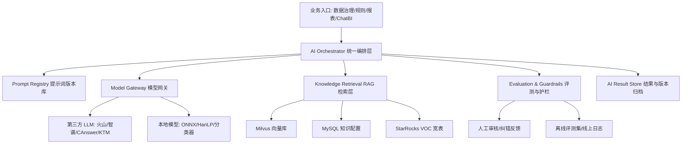

# 数据洞察引擎 AI 工程化改造建议

## 1. 改造目标

当前项目已经具备 VOC 数据治理、规则、知识库、报表、风险分析、ChatBI、向量库和第三方模型服务基础。下一阶段的重点不是“接一个大模型接口”，而是把 AI 能力工程化：可编排、可评估、可回放、可灰度、可观测、可治理、可持续迭代。

建议目标：

1. 建立统一 AI 能力网关，屏蔽火山、智谱、CAnswer、本地 ONNX、Milvus 等差异。
2. 把提示词、规则、模型、知识库、评估集纳入版本管理。
3. 建立 VOC 专用 RAG 与标签/观点/规则辅助生成能力。
4. 建立离线评测 + 在线反馈闭环，持续提升准确率。
5. 将 AI 结果与人工审核、纠错、规则命中联动，形成可追溯数据资产。

## 2. 当前工程基础判断

### 2.1 已具备的基础

- 后端微服务分层较完整：app、service、component、config。
- 数据底座覆盖 MySQL、Redis、Kafka、StarRocks、Milvus、MinIO。
- 已有 AI/模型相关模块：`voc-service-ai-workflow`、`voc-service-analysis`、`voc-service-third`、`voc-service-chat-bi`。
- 已有 LiteFlow、ONNX Runtime、HanLP、Milvus、第三方 LLM Client。
- 前端已有知识中心、规则引擎、新词发现、纠错审核，天然适合作为 AI 反馈入口。
- 后端已有报表 SSE 接口，可承载流式生成类体验。

### 2.2 主要短板

1. AI 调用可能分散在不同业务服务中，模型选择、重试、降级、日志、成本统计难统一。
2. Prompt、规则、模型版本与业务结果之间缺少强绑定，问题回溯困难。
3. 缺少标准化评测集，AI 改动难判断是否真实变好。
4. 人工纠错与审核数据尚未形成明确的训练/评估闭环。
5. 知识库、标签体系、标准观点、用车场景与 RAG 检索之间需要更强的工程连接。
6. 多模型供应商接入后，缺少熔断、限流、配额、成本与安全治理。
7. 前后端类型、接口契约和测试覆盖仍可加强。

## 3. 推荐目标架构



## 4. 核心改造一：统一 AI Orchestrator

### 4.1 职责

新增或强化一个统一 AI 编排服务，建议放在 `voc-service-ai-workflow` 或新建 `voc-service-ai-platform`。

职责包括：

- 接收业务任务：标签推荐、观点归一、摘要生成、风险研判、报表解读、规则生成、ChatBI 问数。
- 根据任务类型选择 Prompt、模型、知识检索器、输出 Schema。
- 管理多步骤链路：预处理、检索、生成、校验、后处理、落库。
- 记录完整 Trace：输入、Prompt 版本、模型版本、知识版本、输出、耗时、Token、费用、错误。
- 对外提供稳定 API，业务服务不直接耦合具体模型厂商。

### 4.2 任务抽象

建议统一任务对象：

```json
{
  "taskType": "VOC_TAG_RECOMMEND",
  "tenantId": "clientId",
  "requestId": "traceId",
  "input": {},
  "context": {
    "channel": "渠道",
    "brand": "品牌",
    "scene": "业务场景"
  },
  "options": {
    "stream": false,
    "modelPolicy": "quality_first",
    "temperature": 0.2
  }
}
```

### 4.3 输出抽象

所有 AI 任务必须结构化输出：

```json
{
  "success": true,
  "taskType": "VOC_TAG_RECOMMEND",
  "model": "provider/model",
  "promptVersion": "v2026.06.01",
  "knowledgeVersion": "taglib_2026.06.01",
  "result": {},
  "confidence": 0.86,
  "evidence": [],
  "warnings": [],
  "traceId": "..."
}
```

## 5. 核心改造二：Prompt Registry

### 5.1 为什么必须做

VOC 场景中 Prompt 会直接影响标签、观点、摘要和风险判断。Prompt 如果只写在代码里，会导致：

- 无法灰度。
- 无法回滚。
- 无法解释某次结果为什么变化。
- 无法做 A/B 测试。

### 5.2 建议能力

- Prompt 模板管理：名称、任务类型、版本、状态、变量、适用客户/渠道。
- Prompt 发布流：草稿、评审、发布、下线。
- Prompt 变量校验：缺变量不允许执行。
- Prompt 版本绑定：AI 输出记录必须保存 promptId 和 promptVersion。
- Prompt 对比评测：同一评测集比较多个版本的准确率、召回率、人工接受率、成本、耗时。

### 5.3 推荐表

- `ai_prompt_template`
- `ai_prompt_version`
- `ai_prompt_release`
- `ai_prompt_eval_result`

## 6. 核心改造三：VOC 专用 RAG

### 6.1 知识来源

应纳入检索的知识：

- 标签体系。
- 标准观点。
- 语料映射。
- 关键词库。
- 账号词库。
- 体验代码。
- 属性标签。
- 用车场景。
- 品牌车系。
- 历史已审核纠错。
- 高质量人工标注样本。
- 报表指标定义和业务口径。

### 6.2 检索策略

不要只做纯向量检索。VOC 场景建议混合检索：

1. 结构化过滤：客户、渠道、品牌、车系、标签类型、时间。
2. 关键词召回：标准词、同义词、别名、业务黑白名单。
3. 向量召回：Milvus 语义近邻。
4. 重排序：按业务权重、命中字段、相似度、人工质量分综合排序。
5. 证据拼装：返回引用的知识条目 ID、名称、版本和来源。

### 6.3 知识版本

每次 AI 输出必须记录：

- 检索语句。
- 命中的知识 ID。
- 知识版本。
- 向量库集合版本。
- 重排序策略版本。

## 7. 核心改造四：评测体系

### 7.1 离线评测集

从以下来源构建黄金集：

- 已审核通过的纠错数据。
- 人工标注语料。
- 历史规则命中准确样本。
- 高风险/易混淆场景样本。
- 各渠道、品牌、车系、时间段代表性样本。

评测集字段：

- 原始文本。
- 渠道、品牌、车系、客户。
- 标准标签。
- 标准观点。
- 情感/意图。
- 期望摘要或答案。
- 难度等级。
- 适用任务类型。

### 7.2 指标

不同任务使用不同指标：

- 标签推荐：准确率、Top-K 命中率、召回率、宏平均 F1。
- 观点归一：准确率、人工接受率、重复观点合并率。
- 摘要生成：事实一致率、引用覆盖率、人工评分。
- ChatBI：SQL 正确率、指标口径正确率、答案可解释率。
- 风险研判：召回率优先，同时控制误报率。
- 规则生成：语法通过率、测试命中率、人工修改量。

### 7.3 发布门禁

AI 能力上线前必须过门禁：

- 离线评测不低于当前线上版本。
- 关键客户/渠道样本无明显回退。
- 平均延迟和成本在阈值内。
- 失败时可降级到旧版本或规则引擎。

## 8. 核心改造五：人机协同闭环

### 8.1 现有入口

当前系统已有：

- 新词发现。
- 知识中心配置。
- 纠错审核。
- 规则测试。
- 下载与数据查询。

这些入口应成为 AI 反馈闭环。

### 8.2 建议流程

1. AI 生成标签/观点/摘要/规则建议。
2. 前端展示建议、置信度和证据。
3. 人工接受、修改或驳回。
4. 系统记录人工动作、修改前后值、理由。
5. 高质量反馈进入评测集或训练集。
6. 定期评测 Prompt/模型/知识库版本。
7. 通过灰度后发布新版本。

### 8.3 前端改造点

- 在纠错审核中展示 AI 原始建议、人工修正、差异对比。
- 在新词发现中提供“一键生成标准观点/标签建议”。
- 在规则引擎中提供“自然语言生成规则草稿”。
- 在知识中心中提供“相似项检测”和“同义词推荐”。
- 在数据查询详情中展示 AI 分析证据链。

## 9. 核心改造六：ChatBI 工程化

后端已有 ChatBI 模块，包括 category、axis、report、saved-report、scene、template、conversation 等 Controller。

建议增强：

1. 指标语义层：统一指标定义、维度、口径、权限、可查询范围。
2. SQL 生成护栏：只读、限表、限行、限时、禁止危险 SQL。
3. 查询解释：展示使用了哪些指标、维度、筛选条件。
4. 结果校验：SQL 执行前做语法、权限、字段存在性检查。
5. 可视化推荐：根据结果形态选择折线、柱状、排名、明细表。
6. 会话记忆：保留上下文，但每次执行必须显式绑定用户权限。
7. 失败兜底：无法回答时给出可选维度和示例问题。

## 10. 核心改造七：观测与成本治理

### 10.1 Trace

每次 AI 调用必须记录：

- `traceId`
- 用户、客户、渠道、业务模块。
- 任务类型。
- 输入摘要和敏感字段脱敏结果。
- Prompt ID/版本。
- 模型供应商、模型名、版本。
- 检索命中的知识。
- 输出结果。
- 耗时、Token、费用。
- 是否命中缓存。
- 是否人工采纳。

### 10.2 Dashboard

建议建立 AI 运营看板：

- 调用量。
- 成功率。
- 平均延迟/P95/P99。
- Token 和成本。
- 各任务人工采纳率。
- 各客户/渠道准确率。
- 失败原因 Top。
- Prompt/模型版本对比。

### 10.3 告警

- 失败率突增。
- 延迟超过阈值。
- 单客户成本异常。
- 模型供应商不可用。
- 评测指标低于阈值。
- 输出命中敏感词或安全策略。

## 11. 核心改造八：安全与合规

VOC 数据中可能包含姓名、手机号、VIN、投诉内容等敏感信息。AI 改造必须默认安全。

建议：

1. 输入模型前做脱敏策略，可按任务选择可逆/不可逆脱敏。
2. 第三方模型调用记录数据出境和供应商。
3. 高敏客户可配置只使用私有化模型。
4. Prompt 注入防护：对用户输入和知识内容做边界隔离。
5. 输出安全过滤：敏感信息、违规内容、幻觉高风险提示。
6. 导出 AI 结果纳入审计。
7. 模型日志保留周期可配置。

## 12. 核心改造九：前端工程化

### 12.1 类型与接口契约

当前前端 API 中仍有较多 `any`。建议：

- 按业务域补齐 TypeScript 类型。
- 从 OpenAPI/Knife4j 生成 API Client 和类型。
- 统一响应结构 `Response<T>`。
- 列表统一 `PageRequest`、`PageResponse<T>`。

### 12.2 页面模式抽象

可沉淀：

- `usePageTable`：查询、分页、loading、重置。
- `useCrudDialog`：新增/编辑/详情弹窗。
- `useBatchAction`：批量启停、删除、确认。
- `usePermissionAction`：按钮权限判断。
- `TreeListLayout`：左树右表。
- `RuleBuilder`：规则条件动态渲染。

### 12.3 状态管理

- 当前 `middleware` 管理 Header 页签状态是合理的。
- 建议为复杂页面建立局部 Store，避免跨页面状态污染。
- 基础字典、渠道树、标签树、部门树统一缓存和失效策略。

### 12.4 测试

- 单元测试：工具函数、条件生成、权限过滤。
- 组件测试：表单校验、规则构建器、树列表。
- E2E：登录、菜单权限、数据查询、规则创建、审核、下载。
- 视觉回归：主要列表页和弹窗。

## 13. 核心改造十：后端工程化

### 13.1 模块边界

建议明确：

- `insights` 管配置和知识。
- `analysis` 管数据处理和模型分析。
- `risk` 管风险规则和风险数据。
- `report` 管报表展示和下载。
- `chat-bi` 管自然语言问数。
- `ai-platform/workflow` 管 AI 统一编排。

避免业务服务直接互相穿透调用底层表。

### 13.2 接口规范

- 所有接口补齐 OpenAPI 描述。
- 错误码统一。
- 分页、排序、筛选结构统一。
- 导出接口统一返回任务 ID。
- SSE 接口统一事件类型：start、delta、message、error、done。

### 13.3 数据访问

- StarRocks 查询必须模板化和参数化，避免 SQL 拼接风险。
- 高频查询建立物化视图。
- 大列表强制时间范围或分页限制。
- 数据权限条件统一由后端注入，不信任前端传参。

### 13.4 配置治理

- 模型供应商、Prompt、知识库、阈值、灰度策略进入配置中心。
- 环境配置分 local/dev/test/rc/prod。
- 密钥进入安全配置，不落代码库。

## 14. 分阶段路线图

### 阶段一：打基础，2-4 周

- 梳理所有 AI 调用点。
- 建立 AI 调用日志表和统一 Trace。
- 抽象 Model Gateway。
- Prompt 从代码迁移到可版本化配置。
- 从纠错审核数据构建第一版评测集。

交付物：

- AI 调用统一 SDK/Service。
- Prompt Registry MVP。
- 评测集 v1。
- AI 调用监控基础看板。

### 阶段二：RAG 与反馈闭环，4-8 周

- 建立知识向量化流水线。
- 标签、观点、场景、体验代码接入混合检索。
- 新词发现和纠错审核接入 AI 建议。
- 人工采纳/修改/驳回进入反馈表。

交付物：

- VOC RAG 服务。
- AI 建议 UI。
- 人工反馈闭环。
- 离线评测自动任务。

### 阶段三：AI 辅助配置，6-10 周

- 规则自然语言生成草稿。
- 标准观点归一和同义词推荐。
- 标签推荐 Top-K。
- 报表摘要生成带证据链。

交付物：

- 规则生成助手。
- 知识中心智能推荐。
- 报表智能解读。
- 灰度发布机制。

### 阶段四：规模化治理，持续

- 多模型 A/B 测试。
- 成本预算和限额。
- 客户级模型策略。
- 高质量样本自动入库。
- 线上效果与业务指标联动。

交付物：

- AI 运营平台。
- 模型/Prompt/知识版本治理。
- 质量、成本、安全综合看板。

## 15. 优先级建议

P0：

- 统一 AI 调用日志和 Trace。
- Prompt 版本化。
- 评测集 v1。
- 数据脱敏。
- 模型网关。

P1：

- VOC RAG。
- 人工反馈闭环。
- 新词/纠错 AI 建议。
- ChatBI SQL 护栏。
- AI 监控看板。

P2：

- 规则生成助手。
- 知识中心相似项检测。
- 多模型 A/B。
- 自动化评测门禁。
- 成本预算系统。

## 16. 判断标准

工程化改造是否成功，不看接入了多少模型，而看以下指标：

1. 任意 AI 结果能否追溯到输入、Prompt、模型、知识和用户。
2. Prompt 或模型升级前能否自动评估风险。
3. AI 错误能否通过人工反馈进入下一轮优化。
4. 模型不可用时业务是否可降级。
5. 关键任务是否有准确率、采纳率、成本、延迟的量化指标。
6. 不同客户、渠道、品牌的数据权限和隐私是否被严格隔离。

