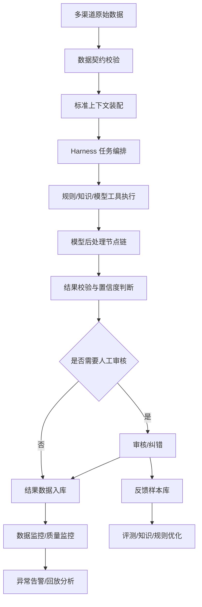

# 洞察引擎 Harness Engineering 重构 PRD

## 1. 重新定义需求

### 1.1 本次重构不是新增一套独立 AI 平台

本次需求的核心不是在现有系统旁边新增“AI 工程化管理后台”，而是基于 Harness Engineering 的思想，对洞察引擎现有业务链路做系统性重构。

重构目标是：让洞察引擎从“页面 + 接口 + 规则 + 模型调用”的业务系统，升级为“可控制、可验证、可回放、可监控、可持续改进”的 VOC 智能处理系统。

换句话说，Harness Engineering 在本项目中的落点是现有业务链路的底层治理方式：

- 数据进入系统前有接入契约。
- 数据进入系统后有标准上下文。
- 规则、模型、知识、后处理都在受控流程中执行。
- 每一步都有输入、输出、版本、责任人、质量结果和异常处理。
- 任意结果都能回放、复核、纠错、评测和持续优化。

### 1.2 本次重构不重点讨论 ChatBI

本 PRD 不覆盖 ChatBI 前端问数、会话、报表模板等功能。现有后端中如存在 ChatBI 服务，也不作为本次重构主线。

本次重构主线聚焦：

1. 数据治理链路。
2. 知识中心链路。
3. 规则引擎链路。
4. 模型处理链路。
5. 模型后处理链路。
6. 人工审核和反馈链路。
7. 数据监控和质量闭环。

## 2. Harness Engineering 在洞察引擎中的产品定义

### 2.1 定义

Harness Engineering 是围绕 AI/规则/数据处理能力构建的“驾驭层”。它负责定义系统如何观察输入、装配上下文、选择工具、执行任务、验证输出、处理异常、记录证据，并把人工反馈重新注入系统。

在洞察引擎中，Harness 不是一个单独模型，也不是一个 Prompt，而是一套贯穿全链路的产品和工程机制。

### 2.2 洞察引擎 Harness 七层结构

1. 数据契约层：定义数据源、字段、质量、接入标准。
2. 上下文装配层：为每条数据装配客户、渠道、品牌、车系、标签体系、知识库、规则、历史样本等上下文。
3. 任务编排层：决定数据需要经过哪些清洗、规则、模型、后处理和审核步骤。
4. 工具执行层：执行规则、关键词匹配、模型推理、知识检索、标签映射等动作。
5. 后处理校验层：将模型输出变成稳定业务结果，并进行校验、归一、兜底和分流。
6. 观测监控层：监控数据质量、处理延迟、模型质量、后处理质量、人工修改率和异常波动。
7. 反馈改进层：把审核、纠错、新词、失败样本沉淀为评测集、知识修正和规则优化输入。

## 3. 重构目标

### 3.1 产品目标

1. 现有数据治理能力从“可查询”升级为“可监控、可追踪、可回放”。
2. 现有知识中心从“配置库”升级为“模型和规则可引用的上下文资产库”。
3. 现有规则引擎从“规则配置和测试”升级为“受控执行工具，可参与 Harness 编排”。
4. 新增模型后处理能力，解决模型输出不可控、不稳定、不可直接入库的问题。
5. 新增数据监控能力，及时发现数据接入、字段质量、标签质量、模型质量和后处理质量异常。
6. 新增统一运行证据链，任意结果能追溯到数据、规则、模型、知识、后处理和人工动作。
7. 新增反馈闭环，让审核、纠错和新词处理成为系统持续改进的燃料。

### 3.2 用户价值

对运营人员：

- 能知道一条结果为什么被打上某个标签。
- 能发现模型或规则异常导致的大量错误。
- 能把人工纠错沉淀为后续优化依据。

对数据治理人员：

- 能监控不同渠道数据是否按时、按量、按质量进入系统。
- 能发现字段缺失、枚举异常、标签覆盖异常。
- 能定位数据链路失败的具体环节。

对算法和规则人员：

- 能观察模型输出质量。
- 能对比后处理前后的差异。
- 能拿到失败样本和人工修正样本。

对管理者：

- 能看到数据治理质量、AI 处理质量、人工介入量、异常趋势。
- 能判断系统是否稳定支撑业务决策。

## 4. 重构前后的系统形态

### 4.1 重构前

现有形态：

- 数据查询看结果。
- 知识中心做配置。
- 规则引擎做规则。
- 审核管理做人工作业。
- 模型或分析服务在后端处理。
- 缺少统一的运行证据和质量闭环。

主要问题：

- 数据异常发现滞后。
- 模型输出缺少稳定后处理。
- 规则、模型、知识之间关系不清。
- 人工纠错没有高效回流。
- 结果很难解释和回放。

### 4.2 重构后

目标形态：

## 5. 角色和权限

### 5.1 系统管理员

- 维护账号、角色、菜单和按钮权限。
- 配置客户、渠道、部门、数据可见范围。
- 查看全量监控和审计。

### 5.2 数据治理人员

- 维护数据源、字段标准、数据质量规则。
- 查看数据接入监控、字段质量监控、异常样本。
- 发起数据修复或重跑。

### 5.3 知识运营人员

- 维护标签、标准观点、关键词、体验代码、属性标签、用车场景、品牌车系。
- 处理新词发现。
- 查看知识被规则、模型、后处理引用的情况。

### 5.4 规则运营人员

- 维护清洗规则、闭环规则、批量规则。
- 测试规则。
- 查看规则执行质量和异常。

### 5.5 算法/模型运营人员

- 查看模型原始输出、后处理结果、置信度、失败样本。
- 维护模型后处理节点和后处理流程。
- 参与评测和发布验证。

### 5.6 审核人员

- 处理低置信、异常、抽检和人工纠错任务。
- 修改或驳回系统结果。
- 形成反馈样本。

## 6. 重构范围总览

本次重构以现有菜单为主，不强制新增大量独立菜单。建议改造为以下业务域：

1. 数据治理重构。
2. 知识中心重构。
3. 规则引擎重构。
4. 模型处理链路重构。
5. 模型后处理节点新增。
6. 审核与反馈闭环重构。
7. 数据监控能力新增。
8. 运行证据链和回放能力新增。
9. 质量评测和发布门禁新增。

## 7. 数据治理重构

### 7.1 目标

把数据治理从“数据查询和新词发现”升级为“数据契约、质量校验、处理状态追踪、异常回放”的入口。

### 7.2 原始数据查询改造

#### 筛选条件

| 筛选项 | 类型 | 说明 |
| --- | --- | --- |
| 时间范围 | 日期时间范围 | 支持数据产生时间、抓取时间 |
| 客户 | 多选 | 按权限过滤 |
| 渠道 | 多选级联 | 支持一级/二级渠道 |
| 数据源 | 多选 | 如 CRM、客服、问卷、社媒等 |
| 品牌 | 多选 |  |
| 车系 | 多选 |  |
| 数据 ID | 输入框 | 精确查询 |
| 关键词 | 输入框 | 搜索原文 |
| 接入状态 | 多选 | 已接入、接入失败、重复、字段异常 |
| 处理状态 | 多选 | 待处理、处理中、已处理、处理失败、已转人工 |
| 数据质量状态 | 多选 | 正常、预警、异常 |

#### 列表字段

| 字段 | 说明 |
| --- | --- |
| 数据 ID | 原始数据唯一标识 |
| 原文摘要 | 脱敏展示 |
| 客户 |  |
| 渠道 |  |
| 数据源 |  |
| 品牌/车系 |  |
| 数据产生时间 |  |
| 抓取时间 |  |
| 接入批次 |  |
| 接入状态 |  |
| 处理状态 |  |
| 字段质量状态 |  |
| 最近处理节点 | 当前或最后处理到的 Harness 节点 |
| 异常原因 | 如有 |
| 操作 | 详情、证据链、重跑、加入样本、导出 |

#### 详情页新增内容

- 原始字段。
- 字段质量校验结果。
- 接入批次信息。
- 标准上下文信息：客户、渠道、品牌、车系、标签体系、适用规则、适用知识。
- 处理链路时间线。
- 模型调用记录。
- 后处理记录。
- 人工审核记录。
- 最终结果关联。

#### 操作

查看详情：

- 查看原始字段、处理状态、证据链和异常原因。

重跑：

- 对处理失败或需要复核的数据重新进入处理链路。
- 支持单条重跑。
- 支持批量重跑。
- 重跑必须记录操作人、原因、时间。

加入样本：

- 将当前数据加入评测样本候选。
- 需补充标准答案或标记待标注。

异常处理：

- 标记已确认。
- 分派处理人。
- 填写处理结论。

#### 异常场景

| 场景 | 系统处理 |
| --- | --- |
| 原始文本为空 | 标记字段异常，不进入模型处理 |
| 核心字段缺失 | 标记字段质量异常，可进入人工补全 |
| 渠道无法识别 | 标记上下文装配失败 |
| 重复数据 | 标记重复，默认不重复处理 |
| 处理链路失败 | 展示失败节点和失败原因 |

### 7.3 结果数据查询改造

#### 筛选条件

| 筛选项 | 类型 | 说明 |
| --- | --- | --- |
| 时间范围 | 日期范围 | 数据产生或处理完成时间 |
| 客户 | 多选 |  |
| 渠道 | 多选 |  |
| 品牌/车系 | 多选 |  |
| 标签体系 | 多选 | CX、CJ、SL、OM 等 |
| 一级/二级/三级标签 | 级联 |  |
| 标准观点 | 输入/多选 |  |
| 情感 | 多选 | 正向、中性、负向 |
| 模型置信度 | 区间 |  |
| 置信度等级 | 多选 | 高、中、低 |
| 后处理状态 | 多选 | 成功、失败、转人工、跳过 |
| 审核状态 | 多选 | 未审核、待审核、通过、修改通过、驳回 |
| 是否人工修改 | 下拉 | 是/否 |
| 异常状态 | 多选 | 正常、预警、异常 |

#### 列表字段

| 字段 | 说明 |
| --- | --- |
| 结果 ID |  |
| 数据 ID | 关联原始数据 |
| 原文摘要 |  |
| 客户 |  |
| 渠道 |  |
| 品牌/车系 |  |
| 标签结果 | 主要标签 |
| 标准观点 |  |
| 情感 |  |
| 关键词 |  |
| 模型置信度 |  |
| 后处理状态 |  |
| 审核状态 |  |
| 是否人工修改 |  |
| 结果版本 | 每次重跑或人工修改形成版本 |
| 处理完成时间 |  |
| 操作 | 详情、证据链、审核记录、回放、纠错 |

#### 详情页新增内容

- 模型原始输出。
- 后处理前后对比。
- 命中的知识和规则。
- 置信度计算来源。
- 人工修改记录。
- 结果版本历史。

#### 操作

纠错：

- 运营人员可提交纠错。
- 纠错进入审核流程。
- 纠错通过后形成新结果版本。

回放：

- 使用同一输入、同一版本配置重新执行处理链路。
- 回放结果不直接覆盖线上结果，需人工确认。

导出：

- 支持按筛选条件导出。
- 敏感字段按权限脱敏。
- 导出进入下载管理。

## 8. 知识中心重构

### 8.1 目标

把知识中心从“人工配置表”升级为 Harness 可调用的上下文资产库。每个知识项都应能被规则、模型、后处理、评测引用，并能看到引用效果。

### 8.2 通用改造要求

适用于语料映射、关键词库、标准观点、体验代码、属性标签、用车场景、品牌车系。

#### 新增通用字段

| 字段 | 说明 |
| --- | --- |
| 知识版本 | 每次发布形成版本 |
| 适用任务 | 可被哪些处理任务引用 |
| 引用次数 | 被规则、模型、后处理引用次数 |
| 最近命中时间 | 最近一次被使用时间 |
| 命中准确率 | 基于人工反馈计算 |
| 异常标记 | 是否存在低质量或冲突 |
| 维护责任人 | 知识负责人 |

#### 通用筛选条件

| 筛选项 | 类型 |
| --- | --- |
| 名称/编码 | 输入框 |
| 客户 | 多选 |
| 渠道 | 多选 |
| 状态 | 启用、禁用、异常 |
| 是否被引用 | 是/否 |
| 适用任务 | 多选 |
| 维护责任人 | 输入框 |
| 更新时间 | 日期范围 |

#### 通用操作

- 新增。
- 编辑。
- 启用。
- 禁用。
- 复制。
- 查看引用。
- 查看命中样本。
- 标记异常。
- 发布版本。
- 回滚版本。

### 8.3 标准观点重构

#### 新增能力

- 相似观点聚合。
- 同义观点管理。
- 未归一观点候选池。
- 模型输出观点归一命中样本。

#### 列表字段

| 字段 | 说明 |
| --- | --- |
| 标准观点 |  |
| 观点编码 |  |
| 同义表达数 |  |
| 关联标签 |  |
| 适用客户 |  |
| 适用渠道 |  |
| 命中次数 |  |
| 人工修改率 |  |
| 状态 |  |
| 操作 | 编辑、同义词、命中样本、禁用、发布 |

#### 异常

- 多个标准观点语义重复。
- 模型输出大量未命中观点。
- 人工频繁修改同一观点。

### 8.4 标签和体验代码重构

#### 新增能力

- 标签被模型推荐、规则命中、人工修改的统计。
- 标签覆盖率监控。
- 标签冲突检测。
- 标签低置信样本查看。

#### 列表字段新增

| 字段 | 说明 |
| --- | --- |
| 模型命中量 | 模型推荐命中次数 |
| 规则命中量 | 规则命中次数 |
| 人工修改量 | 人工纠错次数 |
| 修改率 | 修改量/命中量 |
| 低置信占比 |  |

## 9. 规则引擎重构

### 9.1 目标

将规则引擎从单独的业务规则管理，升级为 Harness 中的可执行工具。规则既可以独立处理数据，也可以参与模型前置过滤、模型后处理校验、异常分流和置信度计算。

### 9.2 闭环规则改造

#### 筛选条件新增

| 筛选项 | 类型 | 说明 |
| --- | --- | --- |
| Harness 使用场景 | 多选 | 前置过滤、模型后处理、结果校验、告警判断 |
| 执行状态 | 多选 | 正常、异常、低命中、高误报 |
| 命中率区间 | 区间 |  |
| 人工驳回率 | 区间 |  |

#### 列表字段新增

| 字段 | 说明 |
| --- | --- |
| 使用场景 | 规则在 Harness 中的角色 |
| 今日执行次数 |  |
| 今日命中次数 |  |
| 命中率 |  |
| 人工驳回率 |  |
| 关联后处理流程 | 如被引用 |
| 质量状态 | 正常、预警、异常 |

#### 操作新增

- 查看执行样本。
- 查看未命中样本。
- 查看误报样本。
- 作为后处理校验规则引用。
- 加入评测集。

### 9.3 规则测试重构

#### 新增测试模式

1. 单规则测试。
2. 规则组测试。
3. 规则 + 模型组合测试。
4. 规则 + 模型 + 后处理全链路测试。

#### 测试结果字段

| 字段 | 说明 |
| --- | --- |
| 测试数据 ID |  |
| 命中规则 |  |
| 命中字段 |  |
| 命中原因 |  |
| 模型输出 | 如参与模型 |
| 后处理结果 | 如参与后处理 |
| 最终结果 |  |
| 是否符合预期 | 人工标注 |
| 差异原因 |  |

## 10. 模型处理链路重构

### 10.1 目标

模型处理不再是不可见的后端黑盒，而是 Harness 任务链路中的一个受控工具。每次模型处理都必须有输入上下文、输出结果、版本信息、执行状态和质量反馈。

### 10.2 模型任务类型

现阶段建议支持：

- 标签推荐。
- 标准观点识别。
- 情感判断。
- 意图识别。
- 关键词抽取。
- 新词识别。
- 摘要生成。
- 风险判断。
- 数据质量识别。

### 10.3 模型处理记录

#### 筛选条件

| 筛选项 | 类型 |
| --- | --- |
| 数据 ID | 输入框 |
| 任务类型 | 多选 |
| 客户 | 多选 |
| 渠道 | 多选 |
| 模型 | 多选 |
| 处理状态 | 成功、失败、超时、降级 |
| 置信度等级 | 高、中、低 |
| 是否进入后处理 | 是/否 |
| 是否进入人工审核 | 是/否 |
| 时间范围 | 日期时间范围 |

#### 列表字段

| 字段 | 说明 |
| --- | --- |
| 处理记录 ID |  |
| 数据 ID |  |
| 任务类型 |  |
| 模型名称 |  |
| 模型版本 |  |
| 输入上下文版本 |  |
| 输出摘要 |  |
| 置信度 |  |
| 处理状态 |  |
| 耗时 |  |
| 异常原因 | 如有 |
| 后处理状态 |  |
| 审核状态 |  |
| 操作 | 详情、重放、加入样本、查看后处理 |

### 10.4 详情页

展示：

- 输入数据摘要。
- 上下文内容摘要。
- 模型原始输出。
- 模型版本。
- Prompt 或任务模板版本。
- 关联知识。
- 后处理结果。
- 人工审核结果。
- 错误信息。

## 11. 模型后处理节点新增

### 11.1 目标

模型后处理节点是本次重构必须新增的核心能力。它解决模型输出不稳定、格式不统一、无法直接写入业务表、无法解释和无法质量控制的问题。

### 11.2 后处理节点不是独立 AI 平台模块

后处理节点应嵌入现有模型处理链路和结果数据链路中。业务人员在数据详情、规则测试、审核详情、监控详情中都能看到后处理过程和结果。

### 11.3 节点类型

| 节点 | 作用 |
| --- | --- |
| 输出结构化节点 | 将模型自然语言输出转成标准字段 |
| 字段补全节点 | 对缺失字段按规则或知识补全 |
| 标签映射节点 | 将模型标签映射到系统标签 |
| 观点归一节点 | 将模型观点归一到标准观点 |
| 关键词清洗节点 | 去重、去噪、同义词合并 |
| 情感修正节点 | 根据规则和上下文修正情感 |
| 置信度计算节点 | 综合模型、规则、知识和历史反馈计算置信度 |
| 规则校验节点 | 校验输出是否符合业务规则 |
| 冲突检测节点 | 检测标签、观点、情感之间冲突 |
| 敏感信息处理节点 | 脱敏或阻断敏感输出 |
| 异常兜底节点 | 输出异常时返回默认值或转人工 |
| 人工分流节点 | 低置信或冲突结果进入审核 |

### 11.4 后处理节点配置

#### 筛选条件

| 筛选项 | 类型 |
| --- | --- |
| 节点名称 | 输入框 |
| 节点类型 | 多选 |
| 适用任务 | 多选 |
| 客户 | 多选 |
| 状态 | 草稿、启用、禁用、异常 |
| 引用流程 | 输入框 |
| 更新时间 | 日期范围 |

#### 列表字段

| 字段 | 说明 |
| --- | --- |
| 节点名称 |  |
| 节点类型 |  |
| 适用任务 |  |
| 输入格式 | 文本、JSON、标签数组等 |
| 输出格式 | 标准业务字段 |
| 引用次数 | 被多少流程引用 |
| 执行成功率 | 最近统计 |
| 失败率 | 最近统计 |
| 状态 |  |
| 更新时间 |  |
| 操作 | 详情、编辑、测试、复制、启用、禁用 |

#### 新增/编辑字段

| 字段 | 必填 | 说明 |
| --- | --- | --- |
| 节点名称 | 是 | 业务名称 |
| 节点类型 | 是 | 从节点类型中选择 |
| 适用任务 | 是 | 如标签推荐、观点识别 |
| 输入字段 | 是 | 节点读取哪些字段 |
| 输出字段 | 是 | 节点产出哪些字段 |
| 处理规则 | 是 | 产品可读规则描述 |
| 异常策略 | 是 | 中断、跳过、默认值、转人工 |
| 低置信策略 | 否 | 低于阈值如何处理 |
| 是否记录差异 | 是 | 记录处理前后差异 |
| 状态 | 是 | 草稿/启用 |

### 11.5 后处理流程

后处理流程由多个节点组成，绑定到模型任务。

#### 流程列表筛选

| 筛选项 | 类型 |
| --- | --- |
| 流程名称 | 输入框 |
| 适用任务 | 多选 |
| 客户 | 多选 |
| 状态 | 启用、禁用、异常 |
| 绑定模型任务 | 输入框 |

#### 流程列表字段

| 字段 | 说明 |
| --- | --- |
| 流程名称 |  |
| 适用任务 |  |
| 节点数量 |  |
| 绑定任务数 |  |
| 今日执行量 |  |
| 今日成功率 |  |
| 转人工率 |  |
| 当前版本 |  |
| 状态 |  |
| 操作 | 详情、编辑、测试、发布、回滚、停用 |

### 11.6 后处理结果在业务页的展示

结果数据详情中必须展示：

- 模型原始输出。
- 后处理节点链路。
- 每个节点输入、输出、状态。
- 最终业务结果。
- 置信度。
- 是否转人工。
- 异常原因。

### 11.7 异常处理

| 异常 | 处理 |
| --- | --- |
| 模型输出无法结构化 | 转人工或返回默认结果 |
| 标签映射失败 | 进入新词/未映射候选 |
| 观点归一失败 | 进入标准观点候选 |
| 标签和情感冲突 | 标记冲突并转人工 |
| 置信度过低 | 转人工审核 |
| 节点执行失败 | 按流程策略中断或跳过 |

## 12. 审核与反馈闭环重构

### 12.1 目标

审核管理不只是审批纠错，而是 Harness 的反馈采集层。人工通过、修改、驳回都应成为系统优化依据。

### 12.2 审核队列来源

- 用户主动纠错。
- 模型低置信结果。
- 后处理失败结果。
- 标签/观点冲突结果。
- 数据质量异常结果。
- 抽检样本。

### 12.3 审核列表筛选

| 筛选项 | 类型 |
| --- | --- |
| 数据 ID | 输入框 |
| 审核来源 | 多选 |
| 客户 | 多选 |
| 渠道 | 多选 |
| 标签体系 | 多选 |
| 置信度等级 | 高、中、低 |
| 审核状态 | 待审核、通过、修改通过、驳回 |
| 提交人 | 输入框 |
| 审核人 | 输入框 |
| 时间范围 | 日期范围 |

### 12.4 审核列表字段

| 字段 | 说明 |
| --- | --- |
| 审核 ID |  |
| 数据 ID |  |
| 原文摘要 |  |
| 审核来源 |  |
| 系统结果 | 模型/规则/后处理结果 |
| 置信度 |  |
| 异常原因 | 如有 |
| 审核状态 |  |
| 客户 |  |
| 渠道 |  |
| 提交时间 |  |
| 审核人 |  |
| 操作 | 详情、通过、修改通过、驳回 |

### 12.5 审核详情

展示：

- 原始数据。
- 系统结果。
- 模型原始输出。
- 后处理过程。
- 命中规则。
- 命中知识。
- 置信度来源。
- 历史相似反馈。
- 人工修改表单。

### 12.6 反馈沉淀

审核动作形成反馈样本：

| 审核动作 | 反馈含义 |
| --- | --- |
| 通过 | 系统结果正确，形成正样本 |
| 修改通过 | 系统结果部分错误，形成纠错样本 |
| 驳回 | 系统结果错误，形成负样本 |

反馈样本字段：

- 数据 ID。
- 原始文本。
- 系统结果。
- 人工结果。
- 差异字段。
- 反馈原因。
- 来源模块。
- 任务类型。
- 客户。
- 渠道。
- 处理人。
- 处理时间。
- 是否加入评测集。

## 13. 数据监控能力新增

### 13.1 目标

数据监控是本次重构的核心新增能力。它不是简单的服务监控，而是业务数据质量监控，覆盖数据接入、字段质量、处理状态、标签质量、模型质量、后处理质量和人工反馈质量。

### 13.2 数据监控总览

#### 筛选条件

| 筛选项 | 类型 |
| --- | --- |
| 客户 | 多选 |
| 渠道 | 多选 |
| 数据源 | 多选 |
| 品牌/车系 | 多选 |
| 时间范围 | 日期时间范围 |
| 统计粒度 | 小时、日、周、月 |

#### 指标卡

| 指标 | 说明 |
| --- | --- |
| 原始数据量 | 接入数据总量 |
| 结果数据量 | 完成处理的数据量 |
| 接入成功率 | 成功接入/应接入 |
| 处理成功率 | 成功处理/待处理 |
| 平均处理延迟 | 数据产生到结果生成 |
| 字段完整率 | 核心字段完整比例 |
| 标签覆盖率 | 有标签结果的数据比例 |
| 低置信占比 | 低置信模型结果比例 |
| 后处理失败率 | 后处理失败/执行总数 |
| 人工修改率 | 人工修改/审核总数 |
| 当前异常数 | 未关闭异常 |

#### 图表

- 数据量趋势。
- 处理成功率趋势。
- 数据延迟趋势。
- 渠道数据分布。
- 标签覆盖率趋势。
- 模型低置信趋势。
- 后处理失败趋势。
- 人工修改率趋势。

### 13.3 数据接入监控

#### 筛选条件

| 筛选项 | 类型 |
| --- | --- |
| 客户 | 多选 |
| 渠道 | 多选 |
| 数据源 | 多选 |
| 接入批次 | 输入框 |
| 接入状态 | 成功、失败、部分失败、延迟 |
| 时间范围 | 日期时间范围 |

#### 列表字段

| 字段 | 说明 |
| --- | --- |
| 接入批次 |  |
| 客户 |  |
| 渠道 |  |
| 数据源 |  |
| 应接入量 |  |
| 实际接入量 |  |
| 成功量 |  |
| 失败量 |  |
| 重复量 |  |
| 开始时间 |  |
| 完成时间 |  |
| 接入耗时 |  |
| 状态 |  |
| 操作 | 详情、失败样本、重试、导出 |

### 13.4 字段质量监控

#### 筛选条件

| 筛选项 | 类型 |
| --- | --- |
| 客户 | 多选 |
| 渠道 | 多选 |
| 字段名称 | 多选 |
| 异常类型 | 缺失、格式错误、枚举异常、长度异常 |
| 时间范围 | 日期范围 |

#### 列表字段

| 字段 | 说明 |
| --- | --- |
| 字段名称 |  |
| 字段中文名 |  |
| 总数据量 |  |
| 缺失量 |  |
| 缺失率 |  |
| 格式异常量 |  |
| 枚举异常量 |  |
| 异常率 |  |
| 阈值 |  |
| 状态 | 正常、预警、异常 |
| 操作 | 样本、趋势、创建告警 |

### 13.5 标签质量监控

#### 筛选条件

| 筛选项 | 类型 |
| --- | --- |
| 客户 | 多选 |
| 渠道 | 多选 |
| 标签体系 | 多选 |
| 标签层级 | 多选 |
| 标签名称 | 输入/多选 |
| 时间范围 | 日期范围 |
| 状态 | 正常、预警、异常 |

#### 列表字段

| 字段 | 说明 |
| --- | --- |
| 标签体系 |  |
| 标签名称 |  |
| 标签层级 |  |
| 数据总量 |  |
| 命中量 |  |
| 覆盖率 |  |
| 环比变化 |  |
| 低置信量 |  |
| 人工修改量 |  |
| 人工修改率 |  |
| 状态 |  |
| 操作 | 趋势、样本、关联知识、关联规则 |

### 13.6 模型和后处理质量监控

#### 筛选条件

| 筛选项 | 类型 |
| --- | --- |
| 任务类型 | 多选 |
| 模型 | 多选 |
| 后处理流程 | 多选 |
| 后处理节点 | 多选 |
| 客户 | 多选 |
| 渠道 | 多选 |
| 时间范围 | 日期时间范围 |

#### 列表字段

| 字段 | 说明 |
| --- | --- |
| 任务类型 |  |
| 模型 |  |
| 后处理流程 |  |
| 调用量 |  |
| 模型成功率 |  |
| 平均置信度 |  |
| 低置信占比 |  |
| 后处理成功率 |  |
| 后处理失败率 |  |
| 转人工率 |  |
| 人工通过率 |  |
| 人工修改率 |  |
| 状态 |  |
| 操作 | 样本、失败原因、证据链 |

### 13.7 告警规则

#### 支持的告警类型

- 数据源无数据。
- 接入失败率过高。
- 字段缺失率过高。
- 标签覆盖率骤降。
- 标签覆盖率异常升高。
- 低置信占比过高。
- 后处理失败率过高。
- 人工修改率过高。
- 处理延迟过高。
- 某渠道数据量异常波动。

#### 告警规则字段

| 字段 | 说明 |
| --- | --- |
| 规则名称 |  |
| 告警类型 |  |
| 监控对象 | 客户、渠道、字段、标签、模型等 |
| 触发条件 | 阈值或变化率 |
| 告警等级 | 高、中、低 |
| 通知对象 | 责任人 |
| 状态 | 启用/禁用 |

## 14. 运行证据链和回放

### 14.1 目标

任意结果都能回答：

- 这条数据从哪里来？
- 经过了哪些规则？
- 调用了哪个模型？
- 使用了哪些知识？
- 后处理做了什么？
- 为什么转人工或没有转人工？
- 人工是否修改过？
- 如果重跑会发生什么？

### 14.2 证据链字段

| 字段 | 说明 |
| --- | --- |
| 数据 ID |  |
| 结果 ID |  |
| 接入批次 |  |
| 上下文版本 |  |
| 规则版本 |  |
| 模型版本 |  |
| Prompt/任务模板版本 |  |
| 知识版本 |  |
| 后处理流程版本 |  |
| 节点执行记录 |  |
| 审核记录 |  |
| 结果版本 |  |

### 14.3 回放能力

支持：

- 单条数据回放。
- 按批次回放。
- 按异常类型回放。
- 使用原版本回放。
- 使用当前版本试跑。

回放结果：

- 不直接覆盖线上结果。
- 生成回放记录。
- 可对比原结果和回放结果。
- 可提交审核后替换结果。

## 15. 评测和发布门禁

### 15.1 目标

规则、模型、知识、后处理流程改动上线前，应通过评测或抽检，避免改动导致大面积结果回退。

### 15.2 评测样本来源

- 人工审核通过样本。
- 人工修改样本。
- 驳回样本。
- 新词处理样本。
- 规则测试样本。
- 历史高质量结果。
- 典型异常样本。

### 15.3 评测对象

- 规则。
- 知识配置。
- 模型任务。
- 后处理节点。
- 后处理流程。
- 全链路处理流程。

### 15.4 评测结果字段

| 字段 | 说明 |
| --- | --- |
| 评测对象 |  |
| 评测版本 |  |
| 样本数量 |  |
| 通过样本数 |  |
| 失败样本数 |  |
| 准确率 |  |
| 召回率 | 如适用 |
| 人工一致率 | 与人工标准答案一致比例 |
| 主要失败原因 |  |
| 是否达到上线门禁 |  |

## 16. 分阶段重构路线

### 16.1 第一阶段：链路可见

目标：

- 数据详情中能看到处理链路。
- 结果详情中能看到模型输出和后处理结果。
- 审核能记录系统结果和人工结果差异。

交付：

- 原始数据详情改造。
- 结果数据详情改造。
- 处理链路时间线。
- 基础证据链。

### 16.2 第二阶段：后处理能力

目标：

- 新增模型后处理节点。
- 后处理结果可展示、可测试、可追踪。

交付：

- 后处理节点。
- 后处理流程。
- 后处理失败转人工。
- 后处理质量统计。

### 16.3 第三阶段：数据监控

目标：

- 发现数据和结果质量异常。
- 支持异常样本查看和处理。

交付：

- 数据监控总览。
- 接入监控。
- 字段质量监控。
- 标签质量监控。
- 模型和后处理质量监控。
- 告警规则。

### 16.4 第四阶段：反馈和评测

目标：

- 人工审核变成反馈资产。
- 改动上线前可评测。

交付：

- 反馈样本库。
- 评测样本管理。
- 全链路评测。
- 发布门禁。

## 17. 验收标准

### 17.1 链路重构验收

1. 任意原始数据能查看接入、处理、模型、后处理、审核链路。
2. 任意结果数据能查看模型原始输出和后处理前后差异。
3. 任意人工修改能记录修改前后差异和原因。

### 17.2 后处理验收

1. 支持至少结构化、标签映射、观点归一、置信度计算、规则校验、人工分流六类节点。
2. 后处理失败能按策略转人工或兜底。
3. 后处理结果可在结果详情中展示。
4. 后处理执行情况可被监控。

### 17.3 数据监控验收

1. 支持数据接入、字段质量、标签质量、模型质量、后处理质量监控。
2. 支持按客户、渠道、时间筛选。
3. 支持查看异常样本。
4. 支持告警规则配置。

### 17.4 反馈闭环验收

1. 审核通过、修改通过、驳回都能形成反馈记录。
2. 反馈记录可加入评测样本。
3. 评测结果可用于规则、模型、后处理流程上线前判断。

## 18. 与上一版 PRD 的差异说明

上一版偏向新增“AI 工程化控制台”，容易把需求理解为独立平台建设。本版修正为：

- 以现有洞察引擎业务链路为主体。
- Harness Engineering 是重构方法和运行机制，不是单独菜单堆叠。
- 模型后处理节点嵌入模型结果链路。
- 数据监控嵌入数据治理和结果质量链路。
- 审核、纠错、新词发现成为反馈闭环。
- 重点从“配置管理”转向“可控执行、可追溯结果、可监控质量、可持续改进”。

