# VOC Cloud 数据库架构图设计文档

## 1. 整体架构图

### 1.1 系统架构概览

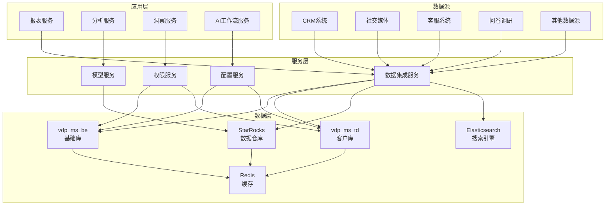

### 1.2 数据流向架构

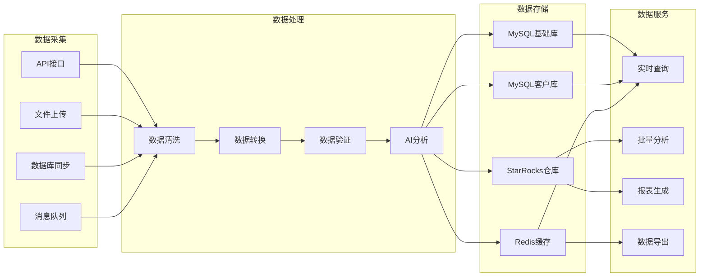

## 2. MySQL数据库架构

### 2.1 基础库架构 (vdp_ms_be)

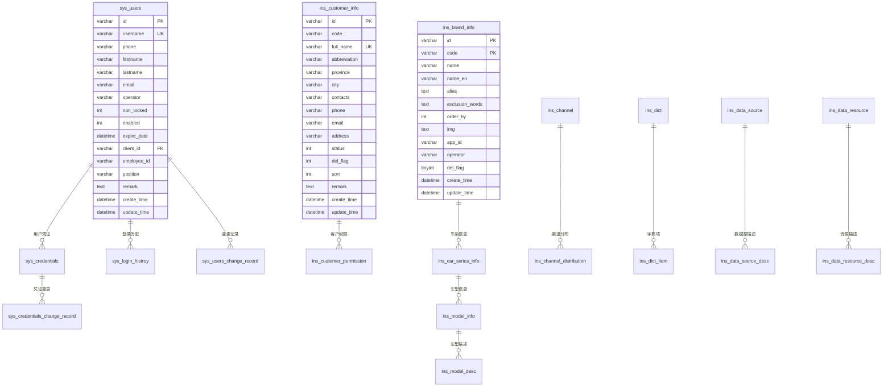

### 2.2 客户库架构 (vdp_ms_td)

```mermaid
erDiagram
    %% 项目管理模块
    ins_project_info ||--o{ ins_project_details : "项目详情"
    
    %% 权限管理模块
    ins_role ||--o{ ins_user_role : "用户角色"
    ins_role ||--o{ ins_role_relation_permission : "角色权限"
    ins_menu_permission ||--o{ ins_role_relation_permission : "权限关联"
    ins_menu_permission ||--o{ ins_menu_permission : "菜单层级"
    
    %% 统计分析模块
    sta_sys_role ||--o{ sta_sys_user_role : "用户角色"
    sta_sys_role ||--o{ sta_sys_role_area : "区域权限"
    sta_sys_role ||--o{ sta_sys_role_business_tag : "业务标签"
    sta_sys_role ||--o{ sta_sys_role_channel : "渠道权限"
    sta_sys_role ||--o{ sta_sys_role_permission : "功能权限"
    sta_sys_role ||--o{ sta_sys_role_quality_tag : "质量标签"
    sta_sys_role ||--o{ sta_sys_role_series : "车系权限"
    sta_sys_depart ||--o{ sta_sys_user_depart : "用户部门"
    sta_sys_depart ||--o{ sta_sys_depart_role_user : "部门角色"
    
    %% 数据源管理模块
    ins_data_source ||--o{ ins_data_source_desc : "数据源描述"
    ins_data_source ||--o{ ins_data_resource : "数据资源"
    ins_data_resource ||--o{ ins_data_resource_desc : "资源描述"
    ins_data_source ||--o{ ins_si_data_source : "SI数据源"
    
    %% 标签管理模块
    ins_tag_client ||--o{ ins_label_correction_record : "标签校正"
    
    %% 区域管理模块
    ins_region ||--o{ ins_region_detail : "区域详情"
    
    %% 客户分析模块
    cli_risk_keywords ||--o{ cli_high_frequency_opinions : "高频意见"
    cli_risk_keywords ||--o{ cli_high_frequency_words : "高频词汇"
    cli_risk_keywords ||--o{ cli_allocation_opinions_record : "意见分配"
    cli_risk_keywords ||--o{ cli_allocation_words_record : "词汇分配"
    
    %% 实体定义
    ins_project_info {
        varchar id PK
        varchar project_Name
        text project_desc
        varchar status
        varchar create_user
        varchar update_user
        datetime create_time
        datetime update_time
    }
    
    ins_role {
        varchar id PK
        varchar role_name
        int role_type
        int enabled
        datetime create_time
        datetime update_time
    }
    
    ins_menu_permission {
        varchar id PK
        varchar parent_id FK
        varchar name
        varchar html_uri
        varchar api_url
        varchar permission_key
        int sort_no
        tinyint last_level
        varchar del_flag
        datetime create_time
    }
    
    sta_sys_role {
        varchar id
        varchar role_name
        varchar role_code
        varchar role_type
        varchar brand_code
        decimal is_export
        decimal is_download
        decimal is_quality
        decimal is_all
        decimal role_status
        text remark
        varchar create_by
        varchar update_by
        datetime create_time
        datetime update_time
    }
    
    ins_data_source {
        varchar id PK
        varchar data_source_name
        varchar data_source_type
        varchar data_source_access_way
        json label_type
        varchar model_type
        varchar create_user
        datetime create_time
    }
```

## 3. StarRocks数据仓库架构

### 3.1 数据仓库分层架构

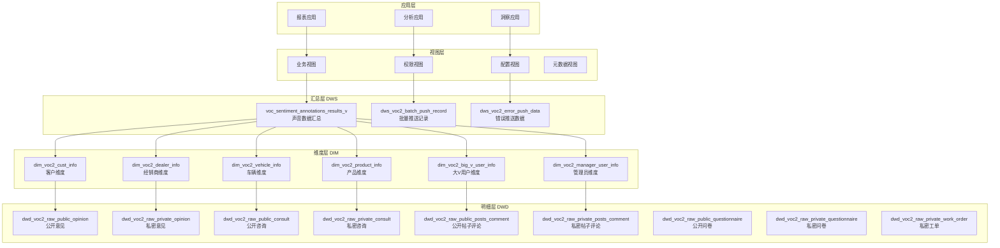

### 3.2 核心事实表结构

```mermaid
erDiagram
    voc_sentiment_annotations_results_v {
        varchar id PK "声音ID"
        varchar data_id "数据唯一标识"
        varchar channel_code "渠道编码"
        varchar channel "渠道名称"
        varchar brand_code "品牌编码"
        varchar brand "品牌名称"
        varchar vehicle_series_code "车系编码"
        varchar vehicle_series "车系名称"
        varchar vehicle_model_code "车型编码"
        varchar vehicle_model "车型名称"
        varchar label_type "数据类型"
        varchar sentiment "情感倾向"
        varchar intention "意图分类"
        text hot_word "热词提取"
        text user_journey "用户旅程"
        text keywords "关键词"
        text topic "观点主题"
        datetime data_create_time "数据产生时间"
        datetime create_time "数据抓取时间"
        varchar dealer_id "经销商ID"
        varchar dealer_code "经销商编码"
        varchar dealer_name "经销商全称"
        varchar dealer_province_code "经销商省份编码"
        varchar dealer_province "经销商省份"
        varchar dealer_city_code "经销商城市编码"
        varchar dealer_city "经销商城市"
        datetime vehicle_purchase_date "车辆购买日期"
        datetime vehicle_production_date "车辆生产日期"
        datetime vehicle_factory_release_date "车辆出厂日期"
        varchar vehicle_vin "车辆车架号"
        varchar one_id "客户唯一标识"
        varchar cust_name "客户姓名"
        varchar cust_mobile "客户手机号"
        int cust_age "客户年龄"
        varchar cust_gender "客户性别"
        varchar cust_province_code "客户省份编码"
        varchar cust_province "客户省份"
        varchar cust_city_code "客户城市编码"
        varchar cust_city "客户城市"
        varchar cust_district_code "客户区县编码"
        varchar cust_district "客户区县"
        varchar cust_highest_edu "客户最高学历"
        varchar cust_monthly_income "客户月收入"
        datetime cust_last_purchase_date "客户最近购车时间"
        varchar cust_type "客户类型"
        boolean is_vehicle_owner "是否车主"
        varchar content_type "原文内容类型"
        varchar work_order_id "工单ID"
        boolean is_main_post "是否主贴"
        text post_title "帖子标题"
        text post_original_link "帖子原文链接"
        text post_original_content "帖子原文详情"
        varchar quest_type "问卷类型"
        text quest_question_content "问卷题目内容"
        int quest_answer_score "问卷答案分数"
        varchar quest_business_type "问卷业务类型"
        varchar quest_business_scenario "问卷业务场景"
        varchar vtr_tag_first_code "VTR标签1级编码"
        varchar vtr_tag_second_code "VTR标签2级编码"
        varchar vtr_tag_three_code "VTR标签3级编码"
        varchar vtr_tag_first "VTR标签1级"
        varchar vtr_tag_second "VTR标签2级"
        varchar vtr_tag_three "VTR标签3级"
        varchar com_tag_first_code "商品化属性标签1级编码"
        varchar com_tag_second_code "商品化属性标签2级编码"
        varchar com_tag_three_code "商品化属性标签3级编码"
        varchar com_tag_first "商品化属性标签1级"
        varchar com_tag_second "商品化属性标签2级"
        varchar com_tag_three "商品化属性标签3级"
        varchar adb_tag_first_code "全领域业务标签1级编码"
        varchar adb_tag_second_code "全领域业务标签2级编码"
        varchar adb_tag_three_code "全领域业务标签3级编码"
        varchar adb_tag_first "全领域业务标签1级"
        varchar adb_tag_second "全领域业务标签2级"
        varchar adb_tag_three "全领域业务标签3级"
        varchar wom_tag_first_code "口碑评价指标1级编码"
        varchar wom_tag_second_code "口碑评价指标2级编码"
        varchar wom_tag_three_code "口碑评价指标3级编码"
        varchar wom_tag_first "口碑评价指标1级"
        varchar wom_tag_second "口碑评价指标2级"
        varchar wom_tag_three "口碑评价指标3级"
        varchar cx_tag_first_code "客户体验指标1级编码"
        varchar cx_tag_second_code "客户体验指标2级编码"
        varchar cx_tag_three_code "客户体验指标3级编码"
        varchar cx_tag_first "客户体验指标1级"
        varchar cx_tag_second "客户体验指标2级"
        varchar cx_tag_three "客户体验指标3级"
        varchar cj_tag_first_code "全旅程客户标签1级编码"
        varchar cj_tag_second_code "全旅程客户标签2级编码"
        varchar cj_tag_three_code "全旅程客户标签3级编码"
        varchar cj_tag_first "全旅程客户标签1级"
        varchar cj_tag_second "全旅程客户标签2级"
        varchar cj_tag_three "全旅程客户标签3级"
        varchar sl_tag_first_code "销售线索标签1级编码"
        varchar sl_tag_second_code "销售线索标签2级编码"
        varchar sl_tag_three_code "销售线索标签3级编码"
        varchar sl_tag_first "销售线索标签1级"
        varchar sl_tag_second "销售线索标签2级"
        varchar sl_tag_three "销售线索标签3级"
        varchar om_tag_first_code "全媒体指标1级编码"
        varchar om_tag_second_code "全媒体指标2级编码"
        varchar om_tag_three_code "全媒体指标3级编码"
        varchar om_tag_first "全媒体指标1级"
        varchar om_tag_second "全媒体指标2级"
        varchar om_tag_three "全媒体指标3级"
        varchar data_create_week "数据产生周期-周"
        varchar data_create_month "数据产生周期-月"
        varchar data_create_quarter "数据产生周期-季"
        varchar data_create_year "数据产生周期-年"
    }
```

## 4. 权限架构设计

### 4.1 权限体系架构

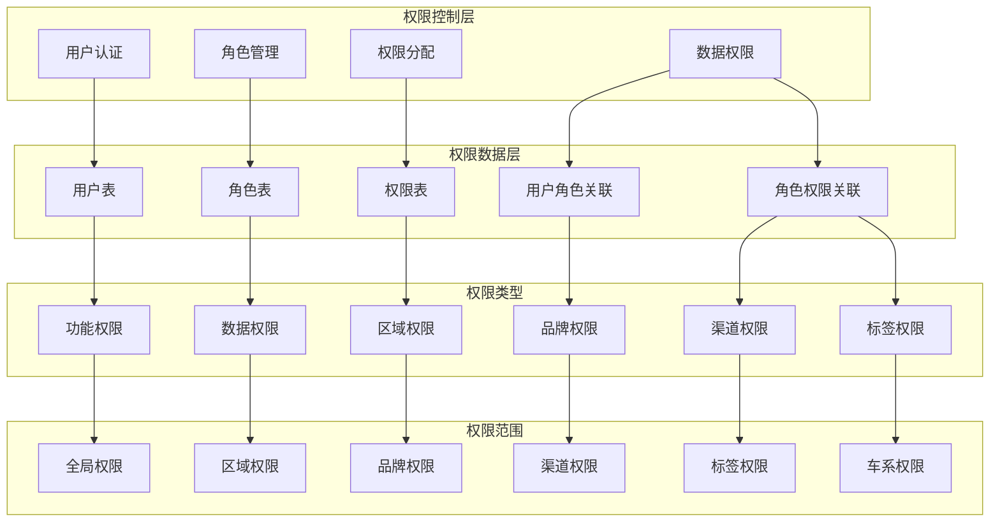

### 4.2 权限关系图

```mermaid
erDiagram
    %% 基础权限体系
    sys_users ||--o{ ins_user_role : "用户角色"
    ins_role ||--o{ ins_user_role : "角色用户"
    ins_role ||--o{ ins_role_relation_permission : "角色权限"
    ins_menu_permission ||--o{ ins_role_relation_permission : "权限角色"
    
    %% 统计权限体系
    sta_sys_role ||--o{ sta_sys_user_role : "统计用户角色"
    sta_sys_role ||--o{ sta_sys_role_area : "区域权限"
    sta_sys_role ||--o{ sta_sys_role_business_tag : "业务标签权限"
    sta_sys_role ||--o{ sta_sys_role_channel : "渠道权限"
    sta_sys_role ||--o{ sta_sys_role_permission : "功能权限"
    sta_sys_role ||--o{ sta_sys_role_quality_tag : "质量标签权限"
    sta_sys_role ||--o{ sta_sys_role_series : "车系权限"
    
    %% 组织机构权限
    sta_sys_depart ||--o{ sta_sys_user_depart : "用户部门"
    sta_sys_depart ||--o{ sta_sys_depart_role_user : "部门角色用户"
    
    %% 实体定义
    sys_users {
        varchar id PK
        varchar username UK
        varchar phone
        varchar email
        int enabled
        varchar client_id
        datetime create_time
    }
    
    ins_role {
        varchar id PK
        varchar role_name
        int role_type
        int enabled
        datetime create_time
    }
    
    ins_menu_permission {
        varchar id PK
        varchar parent_id FK
        varchar name
        varchar html_uri
        varchar api_url
        varchar permission_key
        int sort_no
        tinyint last_level
        varchar del_flag
    }
    
    sta_sys_role {
        varchar id
        varchar role_name
        varchar role_code
        varchar role_type
        varchar brand_code
        decimal is_export
        decimal is_download
        decimal is_quality
        decimal is_all
        decimal role_status
        text remark
    }
    
    sta_sys_depart {
        varchar id
        varchar dept_name
        varchar dept_code
        varchar parent_id
        int dept_level
        int sort_order
        int status
    }
```

## 5. 数据流转架构

### 5.1 完整数据流转图

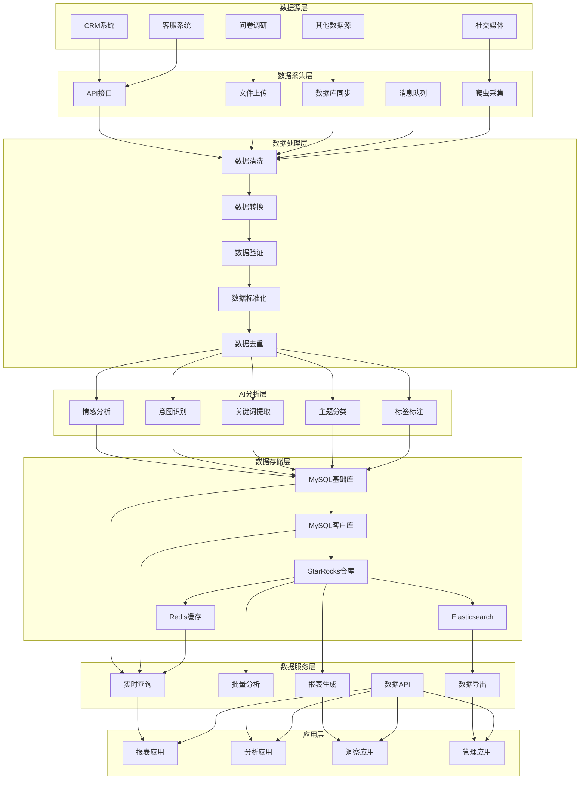

### 5.2 数据同步架构

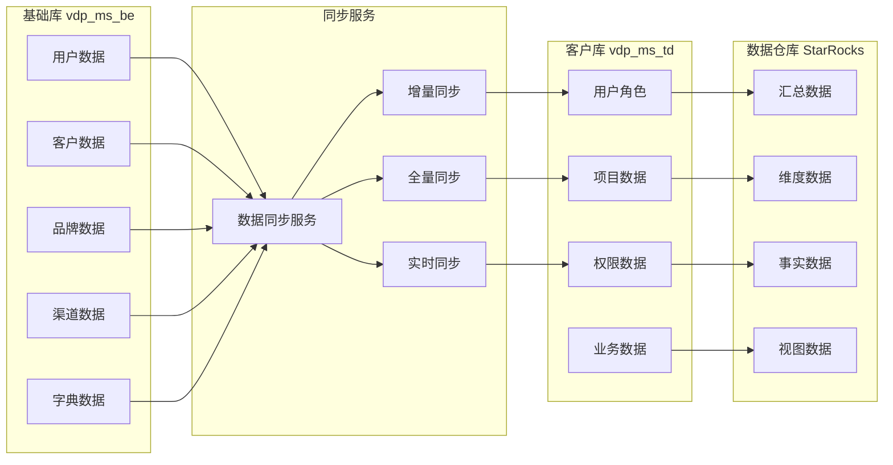

## 6. 性能优化架构

### 6.1 缓存架构

```mermaid
graph TB
    subgraph "应用层缓存"
        CC1[本地缓存]
        CC2[分布式缓存]
        CC3[CDN缓存]
    end
    
    subgraph "数据层缓存"
        DD1[查询缓存]
        DD2[结果缓存]
        DD3[会话缓存]
        DD4[权限缓存]
    end
    
    subgraph "缓存策略"
        EE1[LRU策略]
        EE2[TTL策略]
        EE3[LFU策略]
        EE4[随机策略]
    end
    
    subgraph "缓存存储"
        FF1[Redis主从]
        FF2[Redis集群]
        FF3[本地内存]
        FF4[文件缓存]
    end
    
    CC1 --> DD1
    CC2 --> DD2
    CC3 --> DD3
    
    DD1 --> EE1
    DD2 --> EE2
    DD3 --> EE3
    DD4 --> EE4
    
    EE1 --> FF1
    EE2 --> FF2
    EE3 --> FF3
    EE4 --> FF4
```

### 6.2 索引架构

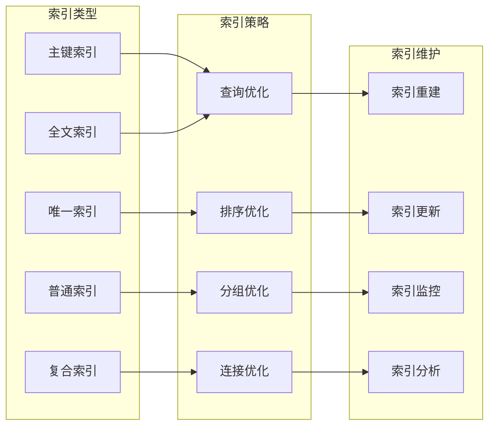

## 7. 安全架构

### 7.1 数据安全架构

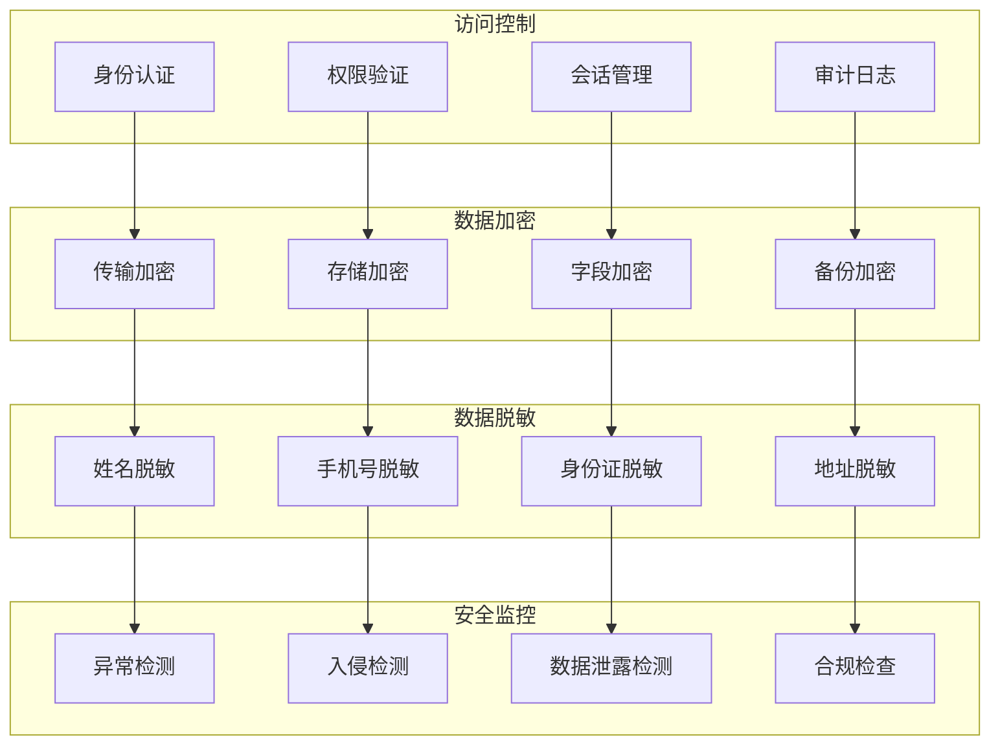

## 8. 监控运维架构

### 8.1 监控架构

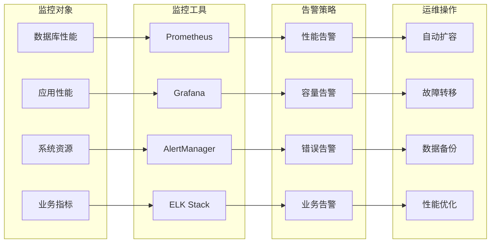

## 9. 扩展性架构

### 9.1 水平扩展架构

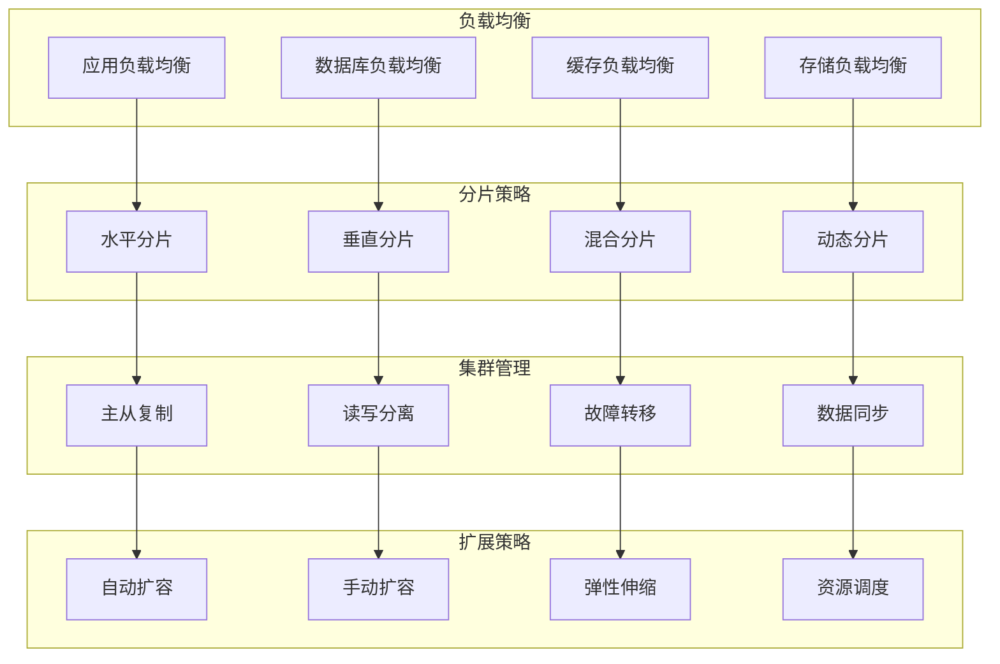

## 10. 总结

### 10.1 架构特点

1. **分层设计**: 采用清晰的分层架构，职责明确，便于维护和扩展
2. **数据分离**: 基础数据和业务数据分离存储，提高安全性和性能
3. **权限控制**: 多层次权限控制体系，确保数据安全
4. **高可用性**: 支持主从复制、故障转移等机制
5. **可扩展性**: 支持水平扩展和垂直扩展
6. **性能优化**: 多级缓存、索引优化、查询优化等策略

### 10.2 技术栈

- **数据库**: MySQL 8.0, StarRocks
- **缓存**: Redis
- **搜索引擎**: Elasticsearch
- **消息队列**: Kafka
- **监控**: Prometheus, Grafana
- **容器化**: Docker, Kubernetes

### 10.3 最佳实践

1. **数据建模**: 遵循星型模型和雪花模型
2. **索引设计**: 根据查询模式设计合适的索引
3. **分区策略**: 按时间和范围进行分区
4. **备份策略**: 定期备份，异地存储
5. **监控告警**: 实时监控，及时告警
6. **安全防护**: 多层次安全防护机制 