# VOC Cloud 数据流转图设计文档

## 1. 数据流转概述

VOC Cloud采用现代化的数据流转架构，支持多数据源接入、实时和批处理、AI智能分析等能力，构建了完整的数据处理链路。

### 1.1 数据流转架构图

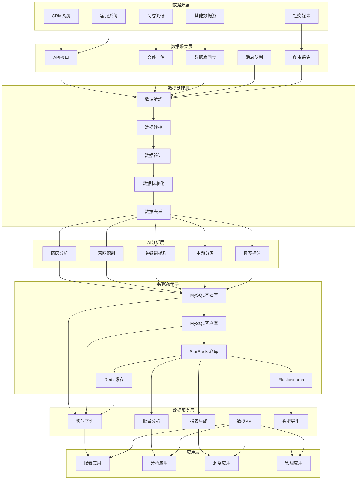

## 2. 数据源层设计

### 2.1 数据源分类

| 数据源类型 | 数据源名称 | 数据格式 | 采集方式 | 更新频率 |
|------------|------------|----------|----------|----------|
| CRM系统 | 客户关系管理系统 | JSON/XML | API接口 | 实时 |
| 社交媒体 | 微博、微信、抖音 | JSON/HTML | 爬虫采集 | 定时 |
| 客服系统 | 客服工单系统 | JSON/CSV | API接口 | 实时 |
| 问卷调研 | 在线问卷系统 | JSON/Excel | 文件上传 | 定时 |
| 其他数据源 | 第三方数据 | 多种格式 | 多种方式 | 不定时 |

### 2.2 数据源配置

#### 2.2.1 数据源表结构 (ins_data_source)

| 字段名 | 数据类型 | 是否为空 | 主键 | 索引 | 说明 |
|--------|----------|----------|------|------|------|
| id | varchar(60) | NO | PRI | - | 数据源ID，主键 |
| data_source_name | varchar(100) | YES | - | - | 数据源名称 |
| data_source_type | varchar(5) | YES | - | - | 数据源类型 |
| data_source_access_way | varchar(20) | YES | - | - | 数据源访问方式 |
| label_type | json | YES | - | - | 标签类型配置 |
| model_type | varchar(10) | YES | - | - | 模型类型 |
| create_user | varchar(100) | YES | - | - | 创建人 |
| create_time | datetime | YES | - | - | 创建时间 |

#### 2.2.2 数据源类型定义

| 数据源类型 | 类型编码 | 说明 | 示例 |
|------------|----------|------|------|
| API接口 | API | 通过API接口获取数据 | CRM系统API |
| 文件上传 | FILE | 通过文件上传获取数据 | 问卷调研文件 |
| 数据库同步 | DB | 通过数据库同步获取数据 | 第三方数据库 |
| 消息队列 | MQ | 通过消息队列获取数据 | Kafka消息 |
| 爬虫采集 | CRAWLER | 通过爬虫采集数据 | 社交媒体爬虫 |

#### 2.2.3 数据源访问方式

| 访问方式 | 方式编码 | 说明 | 配置参数 |
|----------|----------|------|----------|
| HTTP接口 | HTTP | HTTP/HTTPS接口调用 | URL、认证信息 |
| 文件上传 | UPLOAD | 文件上传方式 | 文件格式、大小限制 |
| 数据库连接 | DATABASE | 直接数据库连接 | 连接字符串、认证信息 |
| 消息订阅 | SUBSCRIBE | 消息队列订阅 | 主题、消费者组 |
| 定时任务 | SCHEDULE | 定时任务执行 | 执行频率、执行时间 |

## 3. 数据采集层设计

### 3.1 数据采集架构

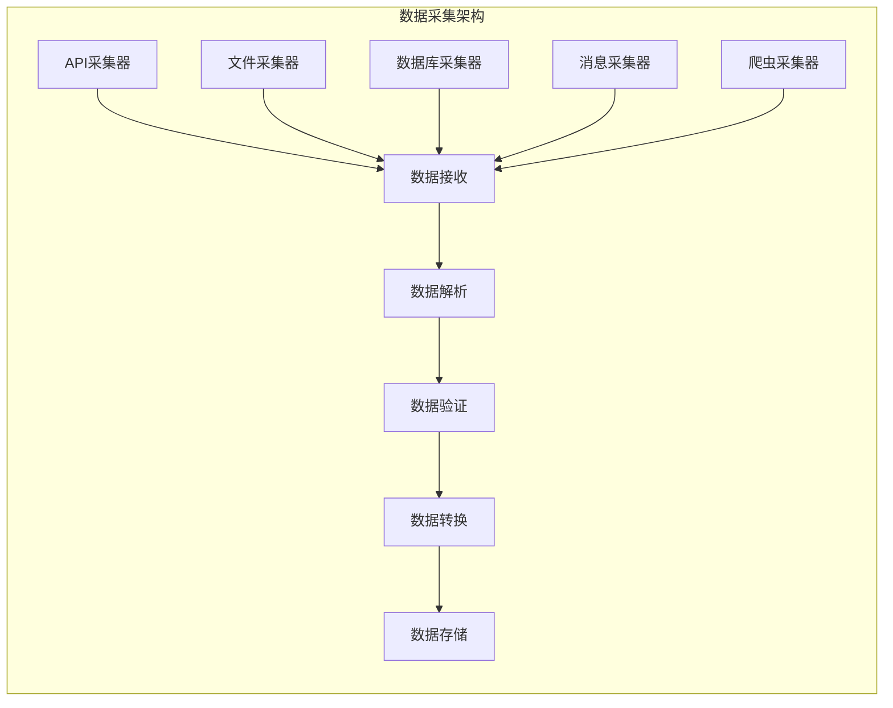

### 3.2 数据采集流程

#### 3.2.1 API数据采集流程

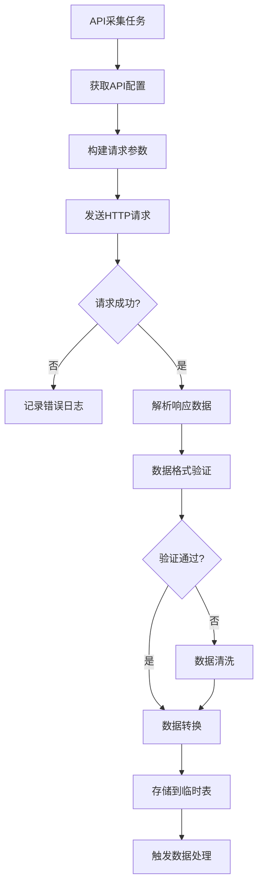

#### 3.2.2 文件数据采集流程

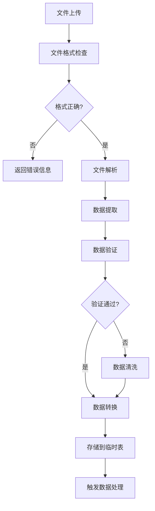

### 3.3 数据采集配置

#### 3.3.1 采集任务配置

| 配置项 | 配置名称 | 配置类型 | 说明 |
|--------|----------|----------|------|
| 任务名称 | task_name | String | 采集任务名称 |
| 数据源ID | data_source_id | String | 关联的数据源ID |
| 采集频率 | frequency | String | 采集频率（实时/定时） |
| 定时表达式 | cron_expression | String | Cron表达式 |
| 重试次数 | retry_count | Integer | 失败重试次数 |
| 超时时间 | timeout | Integer | 请求超时时间 |
| 并发数 | concurrency | Integer | 并发采集数量 |

#### 3.3.2 数据解析配置

| 配置项 | 配置名称 | 配置类型 | 说明 |
|--------|----------|----------|------|
| 数据格式 | data_format | String | 数据格式（JSON/XML/CSV） |
| 编码格式 | encoding | String | 数据编码格式 |
| 分隔符 | delimiter | String | 字段分隔符 |
| 字段映射 | field_mapping | JSON | 字段映射关系 |
| 数据过滤 | data_filter | JSON | 数据过滤条件 |

## 4. 数据处理层设计

### 4.1 数据处理架构

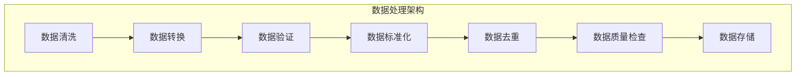

### 4.2 数据处理流程

#### 4.2.1 数据清洗流程

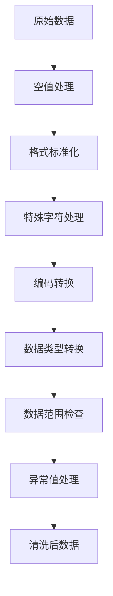

#### 4.2.2 数据转换流程

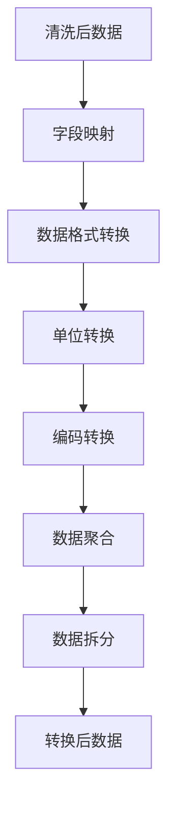

### 4.3 数据处理规则

#### 4.3.1 数据清洗规则

| 规则类型 | 规则名称 | 规则描述 | 处理方式 |
|----------|----------|----------|----------|
| 空值处理 | 空值填充 | 处理空值字段 | 默认值填充 |
| 格式标准化 | 日期格式 | 统一日期格式 | 格式转换 |
| 特殊字符 | 特殊字符清理 | 清理特殊字符 | 字符替换 |
| 编码转换 | 编码统一 | 统一字符编码 | 编码转换 |
| 数据类型 | 类型转换 | 转换数据类型 | 类型转换 |
| 数据范围 | 范围检查 | 检查数据范围 | 范围限制 |
| 异常值 | 异常值处理 | 处理异常值 | 异常值替换 |

#### 4.3.2 数据转换规则

| 规则类型 | 规则名称 | 规则描述 | 转换方式 |
|----------|----------|----------|----------|
| 字段映射 | 字段名称映射 | 映射字段名称 | 名称映射 |
| 格式转换 | 数据格式转换 | 转换数据格式 | 格式转换 |
| 单位转换 | 单位统一 | 统一数据单位 | 单位转换 |
| 编码转换 | 编码统一 | 统一编码格式 | 编码转换 |
| 数据聚合 | 数据聚合 | 聚合相关数据 | 聚合计算 |
| 数据拆分 | 数据拆分 | 拆分复杂数据 | 数据拆分 |

## 5. AI分析层设计

### 5.1 AI分析架构

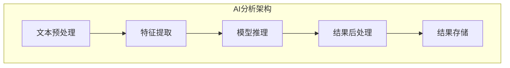

### 5.2 AI分析流程

#### 5.2.1 情感分析流程

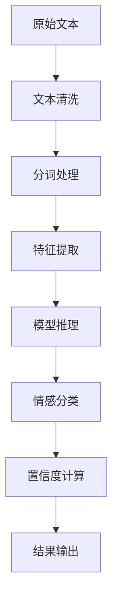

#### 5.2.2 意图识别流程

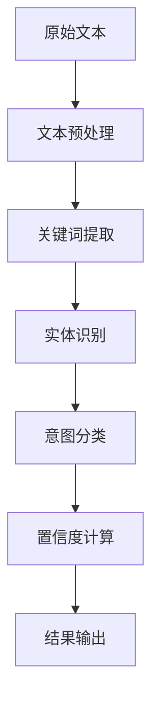

### 5.3 AI模型配置

#### 5.3.1 模型类型配置

| 模型类型 | 模型名称 | 模型描述 | 应用场景 |
|----------|----------|----------|----------|
| 情感分析 | sentiment_model | 情感分析模型 | 分析文本情感倾向 |
| 意图识别 | intention_model | 意图识别模型 | 识别用户意图 |
| 关键词提取 | keyword_model | 关键词提取模型 | 提取文本关键词 |
| 主题分类 | topic_model | 主题分类模型 | 分类文本主题 |
| 实体识别 | entity_model | 实体识别模型 | 识别文本实体 |

#### 5.3.2 模型参数配置

| 参数名称 | 参数类型 | 参数说明 | 默认值 |
|----------|----------|----------|--------|
| 模型版本 | String | 模型版本号 | v1.0 |
| 置信度阈值 | Float | 置信度阈值 | 0.8 |
| 最大长度 | Integer | 文本最大长度 | 512 |
| 批处理大小 | Integer | 批处理大小 | 32 |
| 超时时间 | Integer | 推理超时时间 | 30 |

## 6. 数据存储层设计

### 6.1 数据存储架构

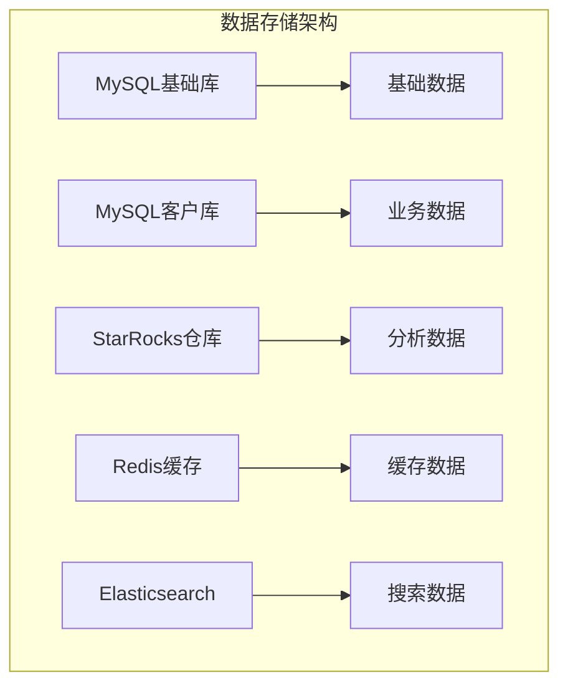

### 6.2 数据存储流程

#### 6.2.1 数据存储流程

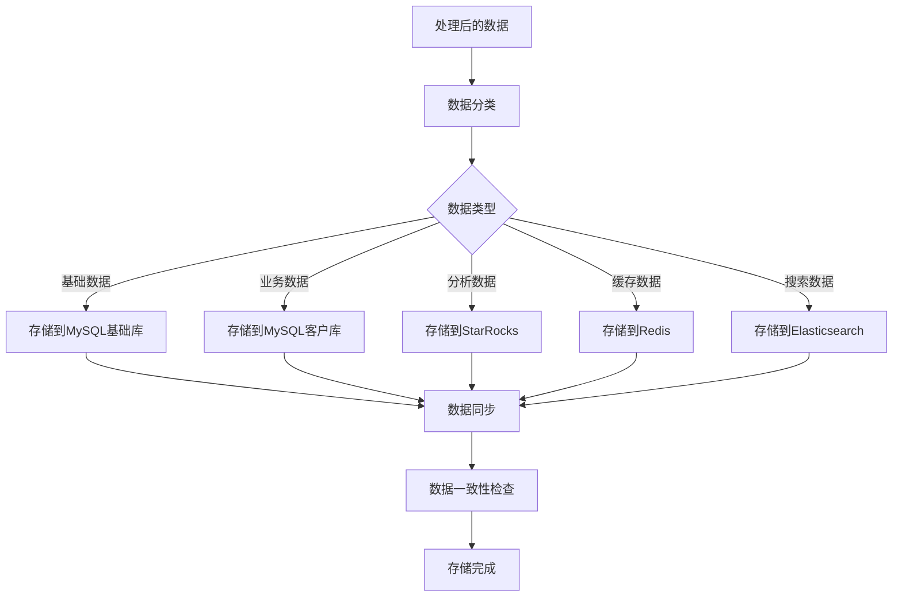

### 6.3 数据存储策略

#### 6.3.1 存储策略配置

| 存储类型 | 存储策略 | 存储周期 | 备份策略 |
|----------|----------|----------|----------|
| MySQL基础库 | 主从复制 | 永久存储 | 每日备份 |
| MySQL客户库 | 主从复制 | 永久存储 | 每日备份 |
| StarRocks | 分区存储 | 永久存储 | 定期备份 |
| Redis | 内存存储 | 临时存储 | 实时备份 |
| Elasticsearch | 分片存储 | 永久存储 | 定期备份 |

#### 6.3.2 数据分区策略

| 分区类型 | 分区字段 | 分区策略 | 说明 |
|----------|----------|----------|------|
| 时间分区 | create_time | 按月分区 | 按创建时间分区 |
| 范围分区 | id | 按ID范围分区 | 按ID范围分区 |
| 哈希分区 | hash_key | 按哈希值分区 | 按哈希值分区 |
| 列表分区 | region | 按区域分区 | 按区域分区 |

## 7. 数据服务层设计

### 7.1 数据服务架构

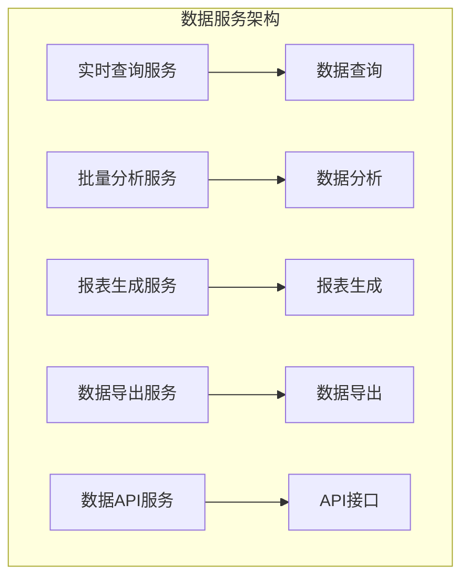

### 7.2 数据服务流程

#### 7.2.1 实时查询流程

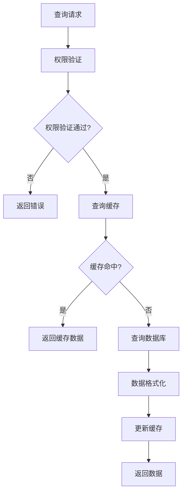

#### 7.2.2 批量分析流程

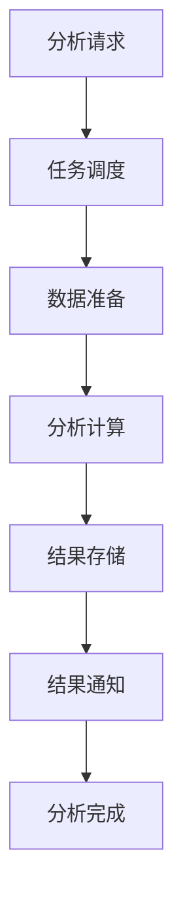

### 7.3 数据服务配置

#### 7.3.1 服务配置参数

| 配置项 | 配置名称 | 配置类型 | 说明 |
|--------|----------|----------|------|
| 连接池大小 | connection_pool_size | Integer | 数据库连接池大小 |
| 查询超时 | query_timeout | Integer | 查询超时时间 |
| 缓存大小 | cache_size | Integer | 缓存大小 |
| 缓存过期时间 | cache_expire | Integer | 缓存过期时间 |
| 并发数 | concurrency | Integer | 并发处理数量 |

#### 7.3.2 API接口配置

| 接口名称 | 接口路径 | 请求方法 | 说明 |
|----------|----------|----------|------|
| 数据查询 | /api/data/query | POST | 查询数据 |
| 数据分析 | /api/data/analyze | POST | 分析数据 |
| 报表生成 | /api/report/generate | POST | 生成报表 |
| 数据导出 | /api/data/export | POST | 导出数据 |
| 数据统计 | /api/data/statistics | GET | 统计数据 |

## 8. 数据质量监控

### 8.1 数据质量监控架构

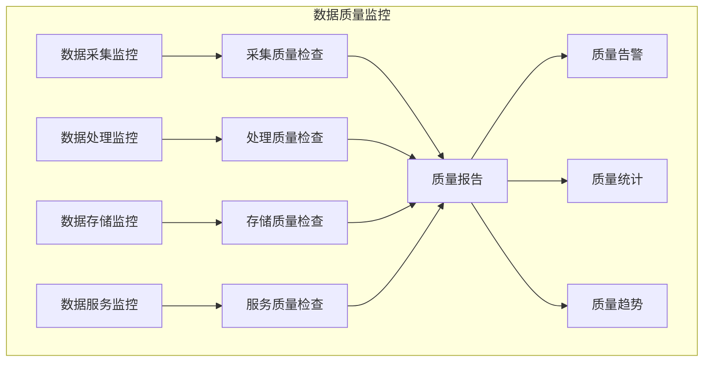

### 8.2 数据质量指标

#### 8.2.1 质量指标定义

| 指标类型 | 指标名称 | 指标描述 | 计算公式 |
|----------|----------|----------|----------|
| 完整性 | 数据完整性 | 数据字段完整性 | 完整字段数/总字段数 |
| 准确性 | 数据准确性 | 数据内容准确性 | 准确数据数/总数据数 |
| 一致性 | 数据一致性 | 数据格式一致性 | 一致数据数/总数据数 |
| 及时性 | 数据及时性 | 数据更新及时性 | 及时数据数/总数据数 |
| 唯一性 | 数据唯一性 | 数据重复程度 | 唯一数据数/总数据数 |

#### 8.2.2 质量监控规则

| 规则类型 | 规则名称 | 规则描述 | 告警阈值 |
|----------|----------|----------|----------|
| 完整性检查 | 必填字段检查 | 检查必填字段是否为空 | <95% |
| 格式检查 | 数据格式检查 | 检查数据格式是否正确 | <90% |
| 范围检查 | 数据范围检查 | 检查数据是否在合理范围 | <85% |
| 重复检查 | 数据重复检查 | 检查数据是否重复 | >10% |
| 时效检查 | 数据时效检查 | 检查数据是否及时更新 | >30分钟 |

### 8.3 数据质量报告

#### 8.3.1 质量报告内容

| 报告项目 | 报告内容 | 报告频率 | 报告方式 |
|----------|----------|----------|----------|
| 数据量统计 | 各数据源数据量 | 每日 | 邮件/短信 |
| 质量指标 | 各项质量指标 | 每日 | 邮件/短信 |
| 异常数据 | 异常数据统计 | 实时 | 告警 |
| 质量趋势 | 质量变化趋势 | 每周 | 报告 |
| 改进建议 | 质量改进建议 | 每月 | 报告 |

## 9. 数据安全保护

### 9.1 数据安全架构

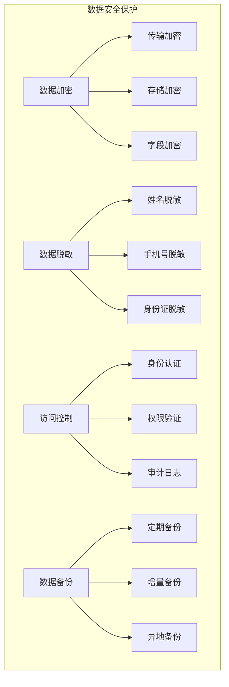

### 9.2 数据安全策略

#### 9.2.1 加密策略

| 加密类型 | 加密算法 | 加密范围 | 密钥管理 |
|----------|----------|----------|----------|
| 传输加密 | TLS/SSL | 数据传输 | 证书管理 |
| 存储加密 | AES | 敏感数据 | 密钥管理 |
| 字段加密 | AES | 敏感字段 | 字段密钥 |
| 备份加密 | AES | 备份数据 | 备份密钥 |

#### 9.2.2 脱敏策略

| 脱敏类型 | 脱敏规则 | 脱敏方式 | 示例 |
|----------|----------|----------|------|
| 姓名脱敏 | 保留姓氏 | 星号替换 | 张** |
| 手机号脱敏 | 保留前3后4位 | 星号替换 | 138****8888 |
| 身份证脱敏 | 保留前6后4位 | 星号替换 | 110101****1234 |
| 邮箱脱敏 | 保留@前2位 | 星号替换 | zh****@example.com |

## 10. 数据流转监控

### 10.1 监控架构

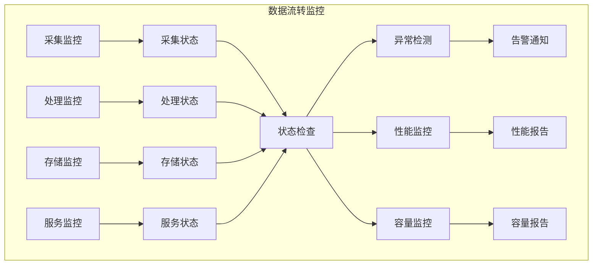

### 10.2 监控指标

#### 10.2.1 性能监控指标

| 指标类型 | 指标名称 | 指标描述 | 监控频率 |
|----------|----------|----------|----------|
| 采集性能 | 采集速率 | 数据采集速率 | 实时 |
| 处理性能 | 处理速率 | 数据处理速率 | 实时 |
| 存储性能 | 存储速率 | 数据存储速率 | 实时 |
| 查询性能 | 查询响应时间 | 数据查询响应时间 | 实时 |
| 服务性能 | 服务响应时间 | 服务响应时间 | 实时 |

#### 10.2.2 容量监控指标

| 指标类型 | 指标名称 | 指标描述 | 告警阈值 |
|----------|----------|----------|----------|
| 存储容量 | 磁盘使用率 | 磁盘空间使用率 | >80% |
| 内存容量 | 内存使用率 | 内存使用率 | >80% |
| CPU容量 | CPU使用率 | CPU使用率 | >80% |
| 网络容量 | 网络带宽使用率 | 网络带宽使用率 | >80% |
| 连接容量 | 连接数使用率 | 数据库连接数使用率 | >80% |

### 10.3 告警机制

#### 10.3.1 告警级别

| 告警级别 | 级别描述 | 处理方式 | 通知方式 |
|----------|----------|----------|----------|
| 严重 | 系统故障 | 立即处理 | 电话+短信+邮件 |
| 警告 | 性能下降 | 及时处理 | 短信+邮件 |
| 信息 | 状态变化 | 关注处理 | 邮件 |
| 调试 | 调试信息 | 记录日志 | 日志 |

#### 10.3.2 告警规则

| 告警类型 | 告警条件 | 告警级别 | 处理时限 |
|----------|----------|----------|----------|
| 数据采集失败 | 连续失败3次 | 严重 | 30分钟 |
| 数据处理超时 | 处理时间>5分钟 | 警告 | 1小时 |
| 存储空间不足 | 使用率>80% | 警告 | 2小时 |
| 服务响应超时 | 响应时间>10秒 | 警告 | 30分钟 |
| 数据质量下降 | 质量指标<80% | 信息 | 4小时 |

## 11. 数据流转优化

### 11.1 性能优化策略

#### 11.1.1 采集优化

| 优化策略 | 优化方法 | 优化效果 | 适用场景 |
|----------|----------|----------|----------|
| 并发采集 | 多线程并发 | 提高采集效率 | 大量数据采集 |
| 批量采集 | 批量处理 | 减少网络开销 | 批量数据采集 |
| 增量采集 | 增量更新 | 减少重复采集 | 增量数据更新 |
| 缓存采集 | 缓存机制 | 减少重复请求 | 频繁访问数据 |

#### 11.1.2 处理优化

| 优化策略 | 优化方法 | 优化效果 | 适用场景 |
|----------|----------|----------|----------|
| 并行处理 | 多线程并行 | 提高处理效率 | 大量数据处理 |
| 流式处理 | 流式计算 | 减少内存占用 | 大数据处理 |
| 缓存处理 | 缓存机制 | 减少重复计算 | 重复数据处理 |
| 索引优化 | 索引优化 | 提高查询效率 | 频繁查询场景 |

### 11.2 容量优化策略

#### 11.2.1 存储优化

| 优化策略 | 优化方法 | 优化效果 | 适用场景 |
|----------|----------|----------|----------|
| 数据压缩 | 压缩存储 | 减少存储空间 | 大量数据存储 |
| 数据分区 | 分区存储 | 提高查询效率 | 大数据存储 |
| 数据归档 | 归档存储 | 减少存储成本 | 历史数据存储 |
| 数据清理 | 定期清理 | 释放存储空间 | 临时数据存储 |

#### 11.2.2 缓存优化

| 优化策略 | 优化方法 | 优化效果 | 适用场景 |
|----------|----------|----------|----------|
| 多级缓存 | 分层缓存 | 提高访问效率 | 频繁访问数据 |
| 缓存预热 | 预热机制 | 减少冷启动 | 系统启动 |
| 缓存更新 | 更新策略 | 保证数据一致性 | 数据更新频繁 |
| 缓存淘汰 | 淘汰策略 | 控制缓存大小 | 内存有限 |

## 12. 总结

### 12.1 数据流转特点

1. **完整性**: 覆盖数据采集、处理、存储、服务的完整链路
2. **实时性**: 支持实时和批处理两种模式
3. **智能化**: 集成AI分析能力，提供智能数据处理
4. **可扩展性**: 支持多数据源、多存储方式、多服务模式
5. **高可用性**: 具备容错、备份、监控等机制

### 12.2 技术栈

- **数据采集**: Kafka, Flume, Logstash
- **数据处理**: Spark, Flink, Storm
- **数据存储**: MySQL, StarRocks, Redis, Elasticsearch
- **AI分析**: TensorFlow, PyTorch, ONNX
- **监控告警**: Prometheus, Grafana, AlertManager
- **容器化**: Docker, Kubernetes

### 12.3 最佳实践

1. **数据质量**: 建立完善的数据质量监控体系
2. **性能优化**: 持续优化数据流转性能
3. **安全保护**: 加强数据安全防护措施
4. **监控运维**: 建立完善的监控运维体系
5. **扩展性**: 设计可扩展的数据流转架构 