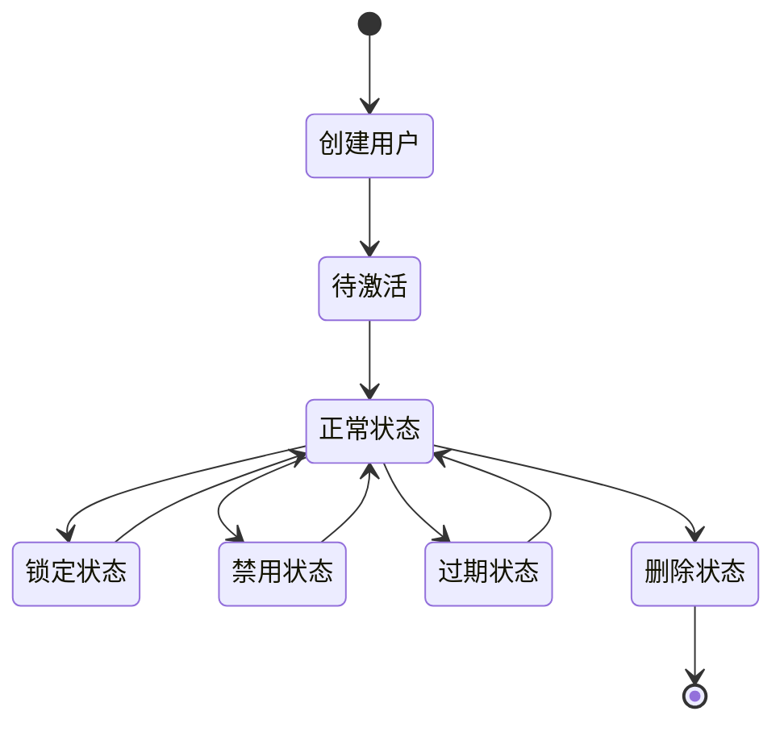
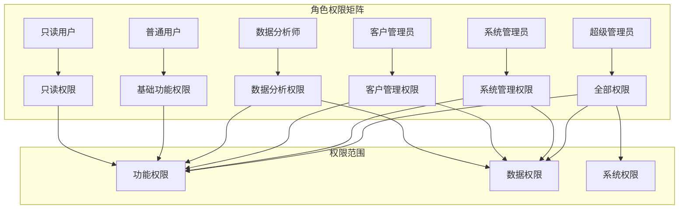
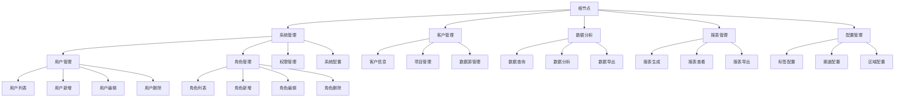
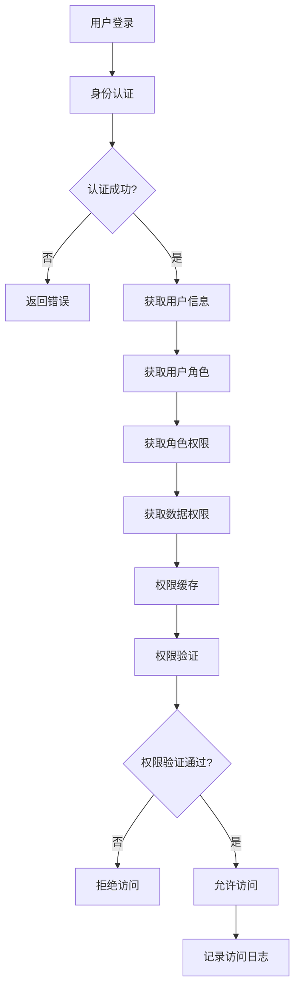
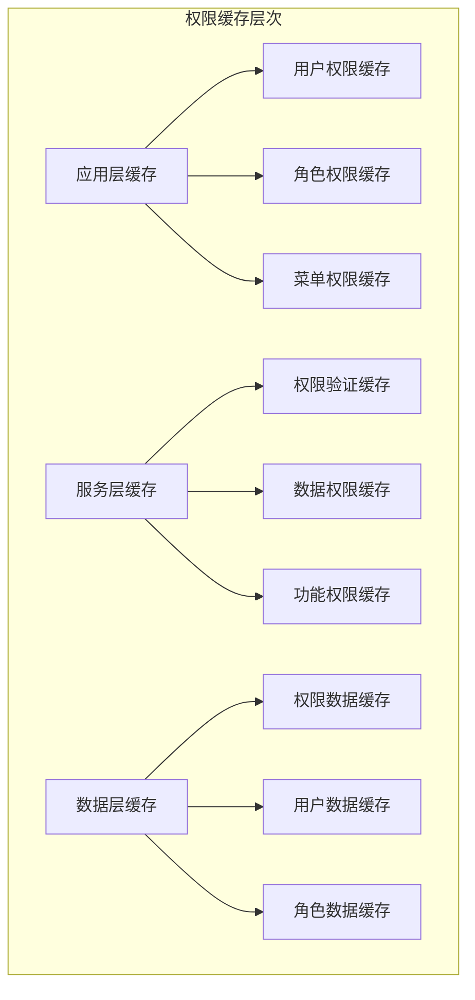
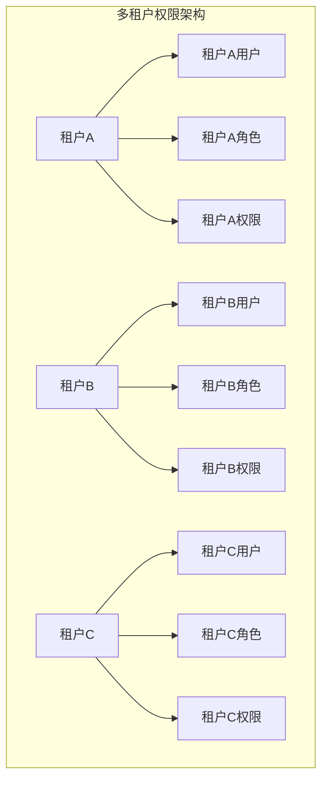
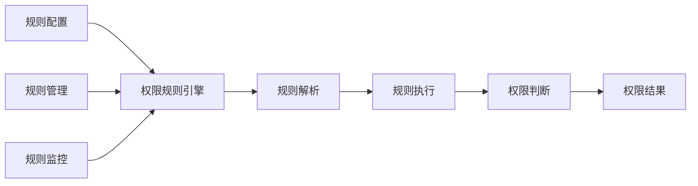

# VOC Cloud 权限体系设计文档

## 1. 权限体系概述

VOC Cloud采用基于角色的访问控制（RBAC）模型，构建了多层次、多维度的权限管理体系，确保数据安全和系统可控。

### 1.1 权限体系架构

```
┌─────────────────────────────────────────────────────────────┐
│                    VOC Cloud 权限体系                        │
├─────────────────────────────────────────────────────────────┤
│  用户层 (User Layer)                                        │
│  ├── 系统用户 (sys_users)                                   │
│  ├── 用户凭证 (sys_credentials)                             │
│  └── 登录历史 (sys_login_histroy)                           │
├─────────────────────────────────────────────────────────────┤
│  角色层 (Role Layer)                                        │
│  ├── 基础角色 (ins_role)                                    │
│  ├── 统计角色 (sta_sys_role)                                │
│  └── 用户角色关联 (ins_user_role, sta_sys_user_role)        │
├─────────────────────────────────────────────────────────────┤
│  权限层 (Permission Layer)                                  │
│  ├── 菜单权限 (ins_menu_permission)                         │
│  ├── 功能权限 (ins_role_relation_permission)                │
│  └── 数据权限 (sta_sys_role_*)                              │
├─────────────────────────────────────────────────────────────┤
│  数据层 (Data Layer)                                        │
│  ├── 区域权限 (sta_sys_role_area)                           │
│  ├── 品牌权限 (sta_sys_role_series)                         │
│  ├── 渠道权限 (sta_sys_role_channel)                        │
│  ├── 标签权限 (sta_sys_role_business_tag, sta_sys_role_quality_tag) │
│  └── 功能权限 (sta_sys_role_permission)                     │
└─────────────────────────────────────────────────────────────┘
```

### 1.2 权限分类

#### 1.2.1 功能权限
- **菜单权限**: 控制用户可访问的菜单和页面
- **操作权限**: 控制用户可执行的操作（增删改查）
- **API权限**: 控制用户可调用的接口

#### 1.2.2 数据权限
- **区域权限**: 控制用户可访问的数据区域
- **品牌权限**: 控制用户可访问的品牌数据
- **渠道权限**: 控制用户可访问的渠道数据
- **标签权限**: 控制用户可访问的标签数据
- **车系权限**: 控制用户可访问的车系数据

#### 1.2.3 系统权限
- **导出权限**: 控制用户是否可导出数据
- **下载权限**: 控制用户是否可下载文件
- **质量权限**: 控制用户是否可进行质量操作
- **全部权限**: 控制用户是否拥有全部权限

## 2. 用户管理设计

### 2.1 用户表结构 (sys_users)

| 字段名 | 数据类型 | 是否为空 | 主键 | 索引 | 说明 |
|--------|----------|----------|------|------|------|
| id | varchar(60) | NO | PRI | - | 用户ID，主键 |
| username | varchar(100) | YES | - | MUL | 用户名，唯一索引 |
| phone | varchar(20) | YES | - | - | 手机号 |
| firstname | varchar(100) | YES | - | - | 名 |
| lastname | varchar(100) | YES | - | - | 姓 |
| email | varchar(50) | YES | - | - | 邮箱 |
| operator | varchar(100) | NO | - | - | 操作员 |
| labelstud_token | varchar(100) | YES | - | - | 标签学习令牌 |
| non_locked | int | NO | - | - | 是否锁定(1:未锁定,0:锁定) |
| enabled | int | NO | - | - | 是否启用(1:启用,0:禁用) |
| expire_date | datetime(3) | NO | - | - | 过期时间 |
| start_expire_date | datetime | YES | - | - | 开始过期时间 |
| client_id | varchar(50) | YES | - | MUL | 客户端ID |
| employee_id | varchar(50) | YES | - | - | 员工ID |
| position | varchar(500) | YES | - | - | 职位 |
| office_phone | varchar(60) | YES | - | - | 办公电话 |
| home_phone | varchar(60) | YES | - | - | 家庭电话 |
| remark | text | YES | - | - | 备注 |
| create_time | datetime | YES | - | - | 创建时间 |
| update_time | datetime | YES | - | - | 更新时间 |

### 2.2 用户状态管理



### 2.3 用户类型分类

| 用户类型 | 说明 | 权限范围 | 数据访问 |
|----------|------|----------|----------|
| 超级管理员 | 系统最高权限 | 全部权限 | 全部数据 |
| 系统管理员 | 系统管理权限 | 系统管理权限 | 全部数据 |
| 客户管理员 | 客户管理权限 | 客户管理权限 | 客户数据 |
| 数据分析师 | 数据分析权限 | 数据分析权限 | 分析数据 |
| 普通用户 | 基础使用权限 | 基础功能权限 | 授权数据 |
| 只读用户 | 只读权限 | 只读权限 | 授权数据 |

## 3. 角色管理设计

### 3.1 基础角色表 (ins_role)

| 字段名 | 数据类型 | 是否为空 | 主键 | 索引 | 说明 |
|--------|----------|----------|------|------|------|
| id | varchar(32) | NO | PRI | - | 角色ID，主键 |
| role_name | varchar(100) | YES | - | - | 角色名称 |
| role_type | int | NO | - | - | 角色类型(1:默认) |
| enabled | int | NO | - | - | 是否启用(1:启用,0:禁用) |
| create_user | varchar(32) | YES | - | - | 创建人 |
| create_time | datetime | YES | - | - | 创建时间 |
| update_time | datetime | YES | - | - | 更新时间 |

### 3.2 统计角色表 (sta_sys_role)

| 字段名 | 数据类型 | 是否为空 | 主键 | 索引 | 说明 |
|--------|----------|----------|------|------|------|
| id | varchar(32) | NO | - | - | 角色ID |
| role_name | varchar(200) | YES | - | - | 角色名称 |
| role_code | varchar(100) | YES | - | - | 角色编码 |
| role_type | varchar(100) | YES | - | - | 角色类型 |
| brand_code | varchar(3000) | YES | - | - | 品牌编码 |
| is_export | decimal(1,0) | YES | - | - | 是否允许导出 |
| is_download | decimal(1,0) | YES | - | - | 是否允许下载 |
| is_quality | decimal(1,0) | YES | - | - | 是否允许质量 |
| is_all | decimal(1,0) | YES | - | - | 是否全部权限 |
| role_status | decimal(1,0) | YES | - | - | 角色状态 |
| remark | text | YES | - | - | 备注 |
| create_by | varchar(32) | YES | - | - | 创建人 |
| update_by | varchar(32) | YES | - | - | 更新人 |
| create_time | datetime | YES | - | - | 创建时间 |
| update_time | datetime | YES | - | - | 更新时间 |

### 3.3 角色分类体系

#### 3.3.1 基础角色类型

| 角色类型 | 角色名称 | 权限范围 | 适用场景 |
|----------|----------|----------|----------|
| 1 | 超级管理员 | 全部权限 | 系统管理 |
| 2 | 系统管理员 | 系统管理权限 | 系统维护 |
| 3 | 客户管理员 | 客户管理权限 | 客户管理 |
| 4 | 数据分析师 | 数据分析权限 | 数据分析 |
| 5 | 普通用户 | 基础功能权限 | 日常使用 |
| 6 | 只读用户 | 只读权限 | 数据查看 |

#### 3.3.2 统计角色类型

| 角色类型 | 角色名称 | 权限范围 | 数据访问 |
|----------|----------|----------|----------|
| ADMIN | 管理员 | 全部权限 | 全部数据 |
| MANAGER | 经理 | 管理权限 | 管理数据 |
| ANALYST | 分析师 | 分析权限 | 分析数据 |
| VIEWER | 查看者 | 查看权限 | 查看数据 |
| EXPORTER | 导出者 | 导出权限 | 导出数据 |

### 3.4 角色权限矩阵



## 4. 权限管理设计

### 4.1 菜单权限表 (ins_menu_permission)

| 字段名 | 数据类型 | 是否为空 | 主键 | 索引 | 说明 |
|--------|----------|----------|------|------|------|
| id | varchar(32) | NO | PRI | - | 权限ID，主键 |
| parent_id | varchar(32) | YES | - | - | 父级ID |
| name | varchar(100) | YES | - | - | 权限名称 |
| html_uri | varchar(255) | YES | - | - | 前端路由 |
| api_url | varchar(255) | YES | - | - | 后端接口 |
| sort_no | int | YES | - | - | 排序号 |
| icon | varchar(100) | YES | - | - | 图标 |
| last_level | tinyint(1) | YES | - | - | 是否最后一级 |
| app_id | varchar(20) | YES | - | - | 应用ID |
| permission_key | varchar(100) | YES | - | - | 权限标识 |
| filter_status | int | YES | - | - | 过滤状态 |
| del_flag | varchar(10) | YES | - | - | 删除标志 |
| create_time | datetime | YES | - | - | 创建时间 |

### 4.2 菜单权限树结构



### 4.3 角色权限关联表 (ins_role_relation_permission)

| 字段名 | 数据类型 | 是否为空 | 主键 | 索引 | 说明 |
|--------|----------|----------|------|------|------|
| id | varchar(32) | NO | PRI | - | 关联ID，主键 |
| role_id | varchar(32) | NO | - | - | 角色ID |
| permission_id | varchar(32) | NO | - | - | 权限ID |
| create_time | datetime | YES | - | - | 创建时间 |

## 5. 数据权限设计

### 5.1 区域权限表 (sta_sys_role_area)

| 字段名 | 数据类型 | 是否为空 | 主键 | 索引 | 说明 |
|--------|----------|----------|------|------|------|
| id | varchar(32) | NO | PRI | - | 权限ID，主键 |
| role_id | varchar(32) | NO | - | - | 角色ID |
| area_code | varchar(50) | NO | - | - | 区域编码 |
| area_name | varchar(100) | NO | - | - | 区域名称 |
| create_time | datetime | YES | - | - | 创建时间 |

### 5.2 品牌权限表 (sta_sys_role_series)

| 字段名 | 数据类型 | 是否为空 | 主键 | 索引 | 说明 |
|--------|----------|----------|------|------|------|
| id | varchar(32) | NO | PRI | - | 权限ID，主键 |
| role_id | varchar(32) | NO | - | - | 角色ID |
| brand_code | varchar(50) | NO | - | - | 品牌编码 |
| brand_name | varchar(100) | NO | - | - | 品牌名称 |
| series_code | varchar(50) | YES | - | - | 车系编码 |
| series_name | varchar(100) | YES | - | - | 车系名称 |
| create_time | datetime | YES | - | - | 创建时间 |

### 5.3 渠道权限表 (sta_sys_role_channel)

| 字段名 | 数据类型 | 是否为空 | 主键 | 索引 | 说明 |
|--------|----------|----------|------|------|------|
| id | varchar(32) | NO | PRI | - | 权限ID，主键 |
| role_id | varchar(32) | NO | - | - | 角色ID |
| channel_code | varchar(50) | NO | - | - | 渠道编码 |
| channel_name | varchar(100) | NO | - | - | 渠道名称 |
| create_time | datetime | YES | - | - | 创建时间 |

### 5.4 业务标签权限表 (sta_sys_role_business_tag)

| 字段名 | 数据类型 | 是否为空 | 主键 | 索引 | 说明 |
|--------|----------|----------|------|------|------|
| id | varchar(32) | NO | PRI | - | 权限ID，主键 |
| role_id | varchar(32) | NO | - | - | 角色ID |
| tag_code | varchar(50) | NO | - | - | 标签编码 |
| tag_name | varchar(100) | NO | - | - | 标签名称 |
| tag_level | int | NO | - | - | 标签级别 |
| create_time | datetime | YES | - | - | 创建时间 |

### 5.5 质量标签权限表 (sta_sys_role_quality_tag)

| 字段名 | 数据类型 | 是否为空 | 主键 | 索引 | 说明 |
|--------|----------|----------|------|------|------|
| id | varchar(32) | NO | PRI | - | 权限ID，主键 |
| role_id | varchar(32) | NO | - | - | 角色ID |
| tag_code | varchar(50) | NO | - | - | 标签编码 |
| tag_name | varchar(100) | NO | - | - | 标签名称 |
| tag_level | int | NO | - | - | 标签级别 |
| create_time | datetime | YES | - | - | 创建时间 |

### 5.6 功能权限表 (sta_sys_role_permission)

| 字段名 | 数据类型 | 是否为空 | 主键 | 索引 | 说明 |
|--------|----------|----------|------|------|------|
| id | varchar(32) | NO | PRI | - | 权限ID，主键 |
| role_id | varchar(32) | NO | - | - | 角色ID |
| permission_code | varchar(50) | NO | - | - | 权限编码 |
| permission_name | varchar(100) | NO | - | - | 权限名称 |
| permission_type | varchar(20) | NO | - | - | 权限类型 |
| create_time | datetime | YES | - | - | 创建时间 |

## 6. 用户角色关联设计

### 6.1 基础用户角色关联表 (ins_user_role)

| 字段名 | 数据类型 | 是否为空 | 主键 | 索引 | 说明 |
|--------|----------|----------|------|------|------|
| id | varchar(32) | NO | PRI | - | 关联ID，主键 |
| user_id | varchar(32) | NO | - | - | 用户ID |
| role_id | varchar(32) | NO | - | - | 角色ID |
| create_time | datetime | YES | - | - | 创建时间 |

### 6.2 统计用户角色关联表 (sta_sys_user_role)

| 字段名 | 数据类型 | 是否为空 | 主键 | 索引 | 说明 |
|--------|----------|----------|------|------|------|
| id | varchar(32) | NO | PRI | - | 关联ID，主键 |
| user_id | varchar(32) | NO | - | MUL | 用户ID |
| role_id | varchar(32) | NO | - | - | 角色ID |
| create_time | datetime | YES | - | - | 创建时间 |

## 7. 权限验证流程

### 7.1 权限验证流程图



### 7.2 权限验证逻辑

#### 7.2.1 功能权限验证

```java
// 功能权限验证伪代码
public boolean checkFunctionPermission(String userId, String permissionKey) {
    // 1. 获取用户角色
    List<String> roleIds = getUserRoles(userId);
    
    // 2. 检查角色是否有权限
    for (String roleId : roleIds) {
        if (hasRolePermission(roleId, permissionKey)) {
            return true;
        }
    }
    
    return false;
}
```

#### 7.2.2 数据权限验证

```java
// 数据权限验证伪代码
public boolean checkDataPermission(String userId, String dataType, String dataId) {
    // 1. 获取用户角色
    List<String> roleIds = getUserRoles(userId);
    
    // 2. 检查数据权限
    for (String roleId : roleIds) {
        if (hasDataPermission(roleId, dataType, dataId)) {
            return true;
        }
    }
    
    return false;
}
```

## 8. 权限管理功能

### 8.1 用户管理功能

| 功能模块 | 功能描述 | 权限要求 |
|----------|----------|----------|
| 用户列表 | 查看用户列表 | 用户管理权限 |
| 用户新增 | 新增用户 | 用户管理权限 |
| 用户编辑 | 编辑用户信息 | 用户管理权限 |
| 用户删除 | 删除用户 | 用户管理权限 |
| 用户启用/禁用 | 启用或禁用用户 | 用户管理权限 |
| 用户锁定/解锁 | 锁定或解锁用户 | 用户管理权限 |
| 密码重置 | 重置用户密码 | 用户管理权限 |
| 角色分配 | 为用户分配角色 | 用户管理权限 |

### 8.2 角色管理功能

| 功能模块 | 功能描述 | 权限要求 |
|----------|----------|----------|
| 角色列表 | 查看角色列表 | 角色管理权限 |
| 角色新增 | 新增角色 | 角色管理权限 |
| 角色编辑 | 编辑角色信息 | 角色管理权限 |
| 角色删除 | 删除角色 | 角色管理权限 |
| 角色启用/禁用 | 启用或禁用角色 | 角色管理权限 |
| 权限分配 | 为角色分配权限 | 角色管理权限 |
| 数据权限配置 | 配置角色数据权限 | 角色管理权限 |

### 8.3 权限管理功能

| 功能模块 | 功能描述 | 权限要求 |
|----------|----------|----------|
| 权限列表 | 查看权限列表 | 权限管理权限 |
| 权限新增 | 新增权限 | 权限管理权限 |
| 权限编辑 | 编辑权限信息 | 权限管理权限 |
| 权限删除 | 删除权限 | 权限管理权限 |
| 权限树管理 | 管理权限树结构 | 权限管理权限 |
| 权限分配 | 分配权限给角色 | 权限管理权限 |

## 9. 权限安全策略

### 9.1 权限安全原则

1. **最小权限原则**: 用户只拥有完成工作所需的最小权限
2. **职责分离原则**: 关键操作需要多人协作完成
3. **权限时效原则**: 权限具有时效性，过期自动失效
4. **权限审计原则**: 所有权限操作都有审计日志
5. **权限继承原则**: 权限可以继承，但可以覆盖

### 9.2 权限安全措施

#### 9.2.1 访问控制

- **身份认证**: 用户名密码、双因子认证
- **会话管理**: 会话超时、并发登录控制
- **IP限制**: 限制登录IP地址范围
- **时间限制**: 限制登录时间段

#### 9.2.2 数据保护

- **数据加密**: 敏感数据加密存储
- **数据脱敏**: 显示时进行数据脱敏
- **数据备份**: 定期备份权限数据
- **数据恢复**: 支持权限数据恢复

#### 9.2.3 审计监控

- **操作日志**: 记录所有权限操作
- **访问日志**: 记录所有数据访问
- **异常监控**: 监控异常权限操作
- **告警机制**: 异常情况及时告警

## 10. 权限性能优化

### 10.1 权限缓存策略

#### 10.1.1 缓存层次



#### 10.1.2 缓存策略

| 缓存类型 | 缓存内容 | 过期时间 | 更新策略 |
|----------|----------|----------|----------|
| 用户权限缓存 | 用户功能权限 | 30分钟 | 权限变更时更新 |
| 角色权限缓存 | 角色功能权限 | 1小时 | 角色变更时更新 |
| 菜单权限缓存 | 菜单树结构 | 2小时 | 菜单变更时更新 |
| 数据权限缓存 | 数据访问权限 | 30分钟 | 数据权限变更时更新 |

### 10.2 权限查询优化

#### 10.2.1 索引优化

```sql
-- 用户角色关联表索引
CREATE INDEX idx_user_role_user_id ON ins_user_role(user_id);
CREATE INDEX idx_user_role_role_id ON ins_user_role(role_id);

-- 角色权限关联表索引
CREATE INDEX idx_role_permission_role_id ON ins_role_relation_permission(role_id);
CREATE INDEX idx_role_permission_permission_id ON ins_role_relation_permission(permission_id);

-- 数据权限表索引
CREATE INDEX idx_role_area_role_id ON sta_sys_role_area(role_id);
CREATE INDEX idx_role_series_role_id ON sta_sys_role_series(role_id);
CREATE INDEX idx_role_channel_role_id ON sta_sys_role_channel(role_id);
```

#### 10.2.2 查询优化

```sql
-- 优化后的权限查询SQL
SELECT DISTINCT p.permission_key
FROM sys_users u
JOIN ins_user_role ur ON u.id = ur.user_id
JOIN ins_role_relation_permission rp ON ur.role_id = rp.role_id
JOIN ins_menu_permission p ON rp.permission_id = p.id
WHERE u.id = ? AND u.enabled = 1 AND p.del_flag = '0';
```

## 11. 权限监控运维

### 11.1 权限监控指标

| 监控指标 | 说明 | 阈值 | 告警级别 |
|----------|------|------|----------|
| 权限验证响应时间 | 权限验证的平均响应时间 | >100ms | 警告 |
| 权限缓存命中率 | 权限缓存的命中率 | <80% | 警告 |
| 权限查询QPS | 权限查询的每秒查询数 | >1000 | 警告 |
| 权限数据量 | 权限相关表的数据量 | >100万 | 警告 |
| 异常权限访问 | 异常权限访问次数 | >10次/分钟 | 严重 |

### 11.2 权限运维操作

#### 11.2.1 日常维护

- **权限数据备份**: 每日备份权限相关数据
- **权限缓存清理**: 定期清理过期缓存
- **权限日志清理**: 定期清理过期日志
- **权限性能监控**: 实时监控权限性能

#### 11.2.2 故障处理

- **权限验证失败**: 检查用户状态、角色状态、权限配置
- **权限缓存异常**: 清理缓存、重启缓存服务
- **权限数据异常**: 恢复备份数据、修复数据一致性
- **权限性能下降**: 优化查询、增加缓存、扩容资源

## 12. 权限扩展设计

### 12.1 多租户权限



### 12.2 动态权限



### 12.3 权限API设计

#### 12.3.1 权限验证API

```java
@RestController
@RequestMapping("/api/permission")
public class PermissionController {
    
    @PostMapping("/check")
    public Result<Boolean> checkPermission(@RequestBody PermissionCheckRequest request) {
        // 权限验证逻辑
    }
    
    @GetMapping("/user/{userId}")
    public Result<List<String>> getUserPermissions(@PathVariable String userId) {
        // 获取用户权限
    }
    
    @GetMapping("/role/{roleId}")
    public Result<List<String>> getRolePermissions(@PathVariable String roleId) {
        // 获取角色权限
    }
}
```

## 13. 总结

### 13.1 权限体系特点

1. **完整性**: 覆盖功能权限、数据权限、系统权限
2. **灵活性**: 支持角色继承、权限组合、动态配置
3. **安全性**: 多层次安全防护、审计监控、异常告警
4. **性能性**: 多级缓存、查询优化、索引优化
5. **可扩展性**: 支持多租户、动态权限、API接口

### 13.2 最佳实践

1. **权限设计**: 遵循最小权限原则，合理设计权限粒度
2. **权限管理**: 建立完善的权限申请、审批、分配流程
3. **权限监控**: 实时监控权限使用情况，及时发现异常
4. **权限优化**: 持续优化权限性能，提升用户体验
5. **权限安全**: 加强权限安全防护，确保数据安全

### 13.3 技术栈

- **数据库**: MySQL 8.0
- **缓存**: Redis
- **框架**: Spring Security
- **监控**: Prometheus + Grafana
- **日志**: ELK Stack 