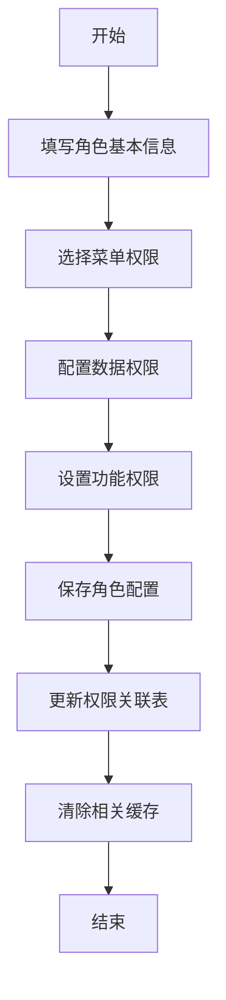
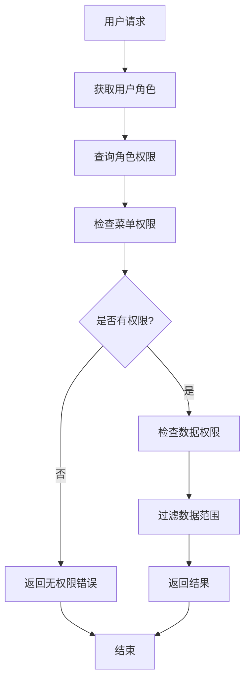
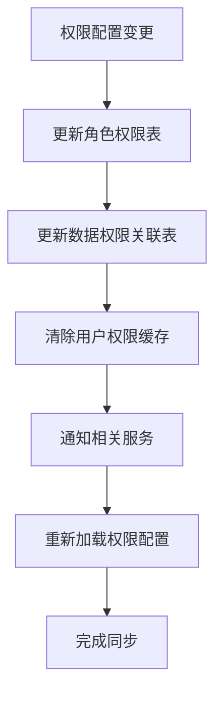

# 角色权限功能说明

## 1. 功能概述

角色权限功能是报表服务中的核心权限管理模块，主要用于管理用户的角色分配和权限控制。该功能支持细粒度的权限控制，包括菜单权限、数据权限、功能权限等多个维度。

### 1.1 主要功能
- 角色管理：创建、编辑、删除角色
- 权限分配：为角色分配菜单权限和功能权限
- 数据权限：控制用户可访问的数据范围（车系、渠道、区域、标签等）
- 用户角色关联：为用户分配角色
- 权限验证：验证用户是否具有特定操作权限

### 1.2 权限控制维度
- **菜单权限**：控制用户可访问的菜单和页面
- **功能权限**：控制导出、下载等功能操作
- **数据权限**：控制用户可查看的数据范围
  - 车系权限：限制可查看的车系数据
  - 渠道权限：限制可查看的渠道数据
  - 区域权限：限制可查看的区域数据
  - 业务标签权限：限制可查看的业务标签数据
  - 质量标签权限：限制可查看的质量标签数据
  - 服务标签权限：限制可查看的服务标签数据

## 2. 核心接口说明

### 2.1 IInsReportRoleService - 角色管理服务

#### 2.1.1 角色查询接口

**分页查询角色列表**
```java
PageInfo queryRoleList(InsReportRoleQueryModel model)
```
- **功能**：分页查询角色列表，支持按角色名称、状态等条件筛选
- **参数**：InsReportRoleQueryModel - 查询条件模型
- **返回**：PageInfo - 分页结果，包含角色基本信息和关联用户数量

**查询角色详情**
```java
RoleReportAuthVo getRoleByRoleId(InsReportRoleQueryModel model)
```
- **功能**：根据角色ID查询角色详细信息，包括权限配置
- **参数**：InsReportRoleQueryModel - 包含roleId的查询模型
- **返回**：RoleReportAuthVo - 角色详细信息，包含所有权限配置

**查询所有角色**
```java
Result<?> queryRoleALlList(InsReportRoleQueryModel model)
```
- **功能**：查询所有角色列表，用于下拉选择等场景
- **参数**：InsReportRoleQueryModel - 查询条件
- **返回**：Result<?> - 包含所有角色的结果

#### 2.1.2 权限查询接口

**查询菜单权限列表**
```java
List<RoleReportAuthVo> queryMenuPermissionList(InsReportRoleQueryModel model)
```
- **功能**：查询菜单权限树结构，用于角色权限配置页面
- **参数**：InsReportRoleQueryModel - 查询条件
- **返回**：List<RoleReportAuthVo> - 菜单权限树结构

**查询菜单权限列表（不使用缓存）**
```java
List<RoleReportAuthVo> queryMenuPermissionListNotCache(InsReportRoleQueryModel model)
```
- **功能**：实时查询菜单权限列表，不使用缓存
- **参数**：InsReportRoleQueryModel - 查询条件
- **返回**：List<RoleReportAuthVo> - 菜单权限列表

**查询用户权限**
```java
UserReportRoleInfoVo queryUserPermission(RoleReportUserVo model)
```
- **功能**：查询指定用户的权限信息，包括菜单权限和功能权限
- **参数**：RoleReportUserVo - 包含用户ID和客户ID
- **返回**：UserReportRoleInfoVo - 用户权限信息

#### 2.1.3 角色操作接口

**保存或更新角色**
```java
Result<?> saveOrUpdateRole(String clientId, List<RoleReportAuthModel> roleModelList)
```
- **功能**：创建新角色或更新现有角色，包括权限配置
- **参数**：
  - clientId：客户ID
  - roleModelList：角色配置列表
- **返回**：Result<?> - 操作结果

**删除角色**
```java
Boolean deleteRole(RoleReportUserVo model)
```
- **功能**：删除指定角色
- **参数**：RoleReportUserVo - 包含角色信息
- **返回**：Boolean - 删除结果

#### 2.1.4 数据权限查询接口

**查询区域权限**
```java
List<String> findRegion(InsReportRoleQueryModel model)
```
- **功能**：查询角色可访问的区域列表
- **参数**：InsReportRoleQueryModel - 查询条件
- **返回**：List<String> - 区域代码列表

**查询渠道权限**
```java
List<String> findChannel(InsReportRoleQueryModel model)
```
- **功能**：查询角色可访问的渠道列表
- **参数**：InsReportRoleQueryModel - 查询条件
- **返回**：List<String> - 渠道代码列表

**查询车系权限**
```java
List<String> findCarSeries(InsReportRoleQueryModel model)
```
- **功能**：查询角色可访问的车系列表
- **参数**：InsReportRoleQueryModel - 查询条件
- **返回**：List<String> - 车系代码列表

**查询业务标签权限**
```java
List<String> findBusinessTag(InsReportRoleQueryModel model)
```
- **功能**：查询角色可访问的业务标签列表
- **参数**：InsReportRoleQueryModel - 查询条件
- **返回**：List<String> - 业务标签代码列表

**查询质量标签权限**
```java
List<String> findQualityTag(InsReportRoleQueryModel model)
```
- **功能**：查询角色可访问的质量标签列表
- **参数**：InsReportRoleQueryModel - 查询条件
- **返回**：List<String> - 质量标签代码列表

#### 2.1.5 辅助查询接口

**获取用户标签类型**
```java
Map<String, String> getLabelTypeByUserId(String userId, String clientId, String brandCode)
```
- **功能**：根据用户ID获取其可访问的标签类型映射
- **参数**：
  - userId：用户ID
  - clientId：客户ID
  - brandCode：品牌代码
- **返回**：Map<String, String> - 标签类型映射

**获取品牌映射**
```java
Map<String, String> getBrandMap(String clientId)
```
- **功能**：获取客户的品牌映射信息
- **参数**：clientId - 客户ID
- **返回**：Map<String, String> - 品牌映射

**获取标签映射**
```java
Map<String, List<TagLibelMappingVo>> getTagLibeMap(InsReportRoleQueryModel model)
```
- **功能**：获取标签库映射信息
- **参数**：InsReportRoleQueryModel - 查询条件
- **返回**：Map<String, List<TagLibelMappingVo>> - 标签映射

### 2.2 IInsReportUserRoleService - 用户角色关联服务

**保存或更新用户角色关联**
```java
Boolean saveOrUpdate(InsReportUserRoleModel insUserRoleModel)
```
- **功能**：为用户分配角色或更新用户角色
- **参数**：InsReportUserRoleModel - 用户角色关联模型
- **返回**：Boolean - 操作结果

**获取用户角色信息**
```java
List<InsReportUserRoleVo> getRoleInfo(InsReportUserRoleModel insUserRoleModel)
```
- **功能**：查询用户的角色信息
- **参数**：InsReportUserRoleModel - 查询条件
- **返回**：List<InsReportUserRoleVo> - 用户角色信息列表

**根据用户ID获取角色ID**
```java
String getRoleIdByUserId(String clientId, String userId)
```
- **功能**：根据用户ID查询其角色ID
- **参数**：
  - clientId：客户ID
  - userId：用户ID
- **返回**：String - 角色ID

**删除用户角色关联**
```java
void deleteRoleUserId(String clientId, String userId)
```
- **功能**：删除用户的角色关联
- **参数**：
  - clientId：客户ID
  - userId：用户ID

**获取角色关联用户数量**
```java
Integer getCountByRole(String roleId)
```
- **功能**：统计指定角色关联的用户数量
- **参数**：roleId - 角色ID
- **返回**：Integer - 用户数量

**获取角色关联的用户ID列表**
```java
List<String> getUserIdByRoleId(String clientId, String roleId)
```
- **功能**：查询指定角色关联的所有用户ID
- **参数**：
  - clientId：客户ID
  - roleId：角色ID
- **返回**：List<String> - 用户ID列表

## 3. 数据权限细分服务

### 3.1 车系权限服务 (IInsReportSysRoleSeriesService)

**保存或更新车系权限**
```java
void saveOrUpdateData(String roleId, RoleReportAuthModel sysRoleModel)
```
- **功能**：为角色配置车系访问权限
- **参数**：
  - roleId：角色ID
  - sysRoleModel：角色权限配置模型

**获取角色车系权限列表**
```java
Map<String, List<String>> getRoleSeriesList(InsReportRoleQueryModel model)
```
- **功能**：查询角色的车系权限配置
- **参数**：InsReportRoleQueryModel - 查询条件
- **返回**：Map<String, List<String>> - 角色车系权限映射

### 3.2 渠道权限服务 (IInsReportSysRoleChannelService)

**保存或更新渠道权限**
```java
void saveOrUpdateData(String roleId, RoleReportAuthModel sysRoleModel)
```

**获取角色渠道权限列表**
```java
Map<String, List<String>> getRoleChanneList(InsReportRoleQueryModel model)
```

### 3.3 区域权限服务 (IInsReportSysRoleAreaService)

**保存或更新区域权限**
```java
void saveOrUpdateData(String roleId, RoleReportAuthModel sysRoleModel)
```

**获取角色区域权限列表**
```java
Map<String, List<String>> getRoleAreaList(InsReportRoleQueryModel model)
```

### 3.4 业务标签权限服务 (IInsReportSysRoleBusinessTagService)

**保存或更新业务标签权限**
```java
void saveOrUpdateData(String roleId, RoleReportAuthModel sysRoleModel)
```

**获取角色业务标签权限列表**
```java
Map<String, List<String>> getRoleBusinessTagList(InsReportRoleQueryModel model)
```

### 3.5 质量标签权限服务 (IInsReportSysRoleQualityTagService)

**保存或更新质量标签权限**
```java
void saveOrUpdateData(String roleId, RoleReportAuthModel sysRoleModel)
```

**获取角色质量标签权限列表**
```java
Map<String, List<String>> getRoleQualityTagList(InsReportRoleQueryModel model)
```

### 3.6 服务标签权限服务 (IInsReportSysRoleServiceTagService)

**保存或更新服务标签权限**
```java
void saveOrUpdateData(String roleId, RoleReportAuthModel sysRoleModel)
```

**获取角色服务标签权限列表**
```java
Map<String, List<String>> getRoleServiceTagList(InsReportRoleQueryModel model)
```

### 3.7 菜单权限服务 (IInsReportSysRolePermissionService)

**保存或更新菜单权限**
```java
void saveOrUpdateData(String roleId, RoleReportAuthModel sysRoleModel)
```

**获取角色菜单权限列表**
```java
List<String> getRolePermissionList(InsReportRoleQueryModel model)
```

## 4. 核心数据模型

### 4.1 RoleReportAuthModel - 角色权限配置模型

```java
public class RoleReportAuthModel {
    private String id;                    // 角色ID（编辑时必传）
    private String roleId;                // 角色ID
    private String clientId;              // 客户ID（必填）
    private String roleName;              // 角色名称（必填）
    private List<String> permissionIdList; // 菜单权限ID列表（必填）
    private List<String> seriesIds;       // 关联车系代码列表（必填）
    private List<String> channelIds;      // 关联渠道ID列表（必填）
    private List<String> businessTagIds;  // 关联业务标签代码列表
    private List<String> serviceTagIds;   // 关联服务标签代码列表
    private List<String> qualityTagIds;   // 关联质量标签代码列表
    private List<String> areaIds;         // 关联区域代码列表（必填）
    private Boolean isExport;             // 是否可以导出
    private Boolean isDownload;           // 是否可以下载
    private Boolean allPermission;        // 是否拥有所有权限
    private String brandCode;             // 品牌代码（必填）
    private Integer enabled;              // 角色状态
    private String remark;                // 备注
}
```

### 4.2 RoleReportAuthVo - 角色权限信息视图

```java
public class RoleReportAuthVo {
    private String roleId;                        // 角色ID
    private String roleName;                      // 角色名称
    private Integer roleType;                     // 角色类型
    private String brandCode;                     // 品牌代码
    private String brandName;                     // 品牌名称
    private List<String> brandCodeList;           // 品牌代码列表
    private Boolean isExport;                     // 是否可导出
    private Boolean isDownload;                   // 是否可下载
    private Boolean allPermission;                // 是否拥有所有权限
    private Integer status;                       // 状态
    private String remark;                        // 备注
    private Boolean checked;                      // 是否选中
    private List<String> appTags;                 // 应用标签
    
    // 数据权限相关
    private List<String> seriesIds;               // 车系权限
    private List<String> serviceTagIds;           // 服务标签权限
    private List<String> channelIds;              // 渠道权限
    private List<String> businessTagIds;          // 业务标签权限
    private List<String> qualityTagIds;           // 质量标签权限
    private List<String> areaIds;                 // 区域权限
    
    // 复杂对象
    private Object dataChannel;                   // 数据渠道
    private Object relationBuTag;                 // 关联业务标签
    private Object qualityTag;                    // 质量标签
    private Object serviceTag;                    // 服务标签
    private List<RelationCarVo> relationCar;      // 关联车系
    private List<RoleReportAuthTree> appKanban;   // 应用看板权限树
    private Object area;                          // 区域
}
```

### 4.3 UserReportRoleInfoVo - 用户权限信息视图

```java
public class UserReportRoleInfoVo {
    private List<ReportRoleAuthListVo> roleAuthListVoList;  // 二级菜单权限树
    private List<InsReportRolePermissionVo> insRolePermissionVos; // 所有权限集合
}
```

## 5. 权限验证流程

### 5.1 用户登录权限获取流程
1. 用户登录后，系统根据用户ID查询其角色信息
2. 根据角色ID查询角色的所有权限配置
3. 构建用户权限信息，包括菜单权限和数据权限
4. 将权限信息缓存到用户会话中

### 5.2 菜单权限验证
1. 用户访问页面时，系统检查用户是否具有对应的菜单权限
2. 根据权限配置决定是否显示菜单项
3. 对于按钮级权限，根据权限配置控制按钮的显示和功能

### 5.3 数据权限验证
1. 用户查询数据时，系统根据用户的数据权限配置过滤数据
2. 在SQL查询中添加相应的WHERE条件
3. 确保用户只能查看其权限范围内的数据

### 5.4 功能权限验证
1. 用户执行导出、下载等操作时，系统检查功能权限
2. 根据角色配置的isExport、isDownload等标志决定是否允许操作

## 6. 使用示例

### 6.1 创建角色示例

```java
// 构建角色权限配置
RoleReportAuthModel roleModel = new RoleReportAuthModel();
roleModel.setClientId("client001");
roleModel.setRoleName("数据分析师");
roleModel.setBrandCode("CHANGAN");
roleModel.setPermissionIdList(Arrays.asList("menu001", "menu002"));
roleModel.setSeriesIds(Arrays.asList("CS75", "CS55"));
roleModel.setChannelIds(Arrays.asList("channel001", "channel002"));
roleModel.setAreaIds(Arrays.asList("area001", "area002"));
roleModel.setIsExport(true);
roleModel.setIsDownload(false);
roleModel.setAllPermission(false);
roleModel.setEnabled(1);

// 调用服务创建角色
List<RoleReportAuthModel> roleList = Arrays.asList(roleModel);
Result<?> result = roleService.saveOrUpdateRole("client001", roleList);
```

### 6.2 为用户分配角色示例

```java
// 构建用户角色关联
InsReportUserRoleModel userRoleModel = new InsReportUserRoleModel();
userRoleModel.setUserId("user001");
userRoleModel.setRoleId("role001");

// 调用服务分配角色
Boolean success = userRoleService.saveOrUpdate(userRoleModel);
```

### 6.3 查询用户权限示例

```java
// 构建查询条件
RoleReportUserVo queryModel = new RoleReportUserVo();
queryModel.setUserId("user001");
queryModel.setClientId("client001");
queryModel.setTree(true);

// 查询用户权限
UserReportRoleInfoVo userPermission = roleService.queryUserPermission(queryModel);
```

## 7. 注意事项

### 7.1 数据安全
- 所有权限相关操作都需要进行客户ID隔离
- 使用@SwitchClientDS注解确保数据源切换正确
- 敏感操作需要记录操作日志

### 7.2 性能优化
- 权限信息建议使用缓存机制
- 对于频繁查询的权限信息，可以考虑Redis缓存
- 菜单权限树结构建议预构建并缓存

### 7.3 扩展性
- 权限模型支持多维度扩展
- 新增权限类型时，需要同步更新相关服务接口
- 权限验证逻辑应该集中管理，便于维护

### 7.4 兼容性
- 角色权限配置变更时，需要考虑对现有用户的影响
- 权限升级时应该提供数据迁移方案
- API接口变更需要保持向后兼容

## 8. REST API接口说明

### 8.1 角色管理接口

#### 8.1.1 分页查询角色列表
- **接口路径**：`POST /role/list`
- **功能描述**：分页查询角色列表，支持按条件筛选
- **请求参数**：
```json
{
  "pageNum": 1,
  "pageSize": 10,
  "enabled": "1",
  "roleName": "管理员",
  "clientId": "client001",
  "brandCode": "CHANGAN"
}
```
- **响应示例**：
```json
{
  "code": 200,
  "message": "操作成功",
  "data": {
    "total": 50,
    "list": [
      {
        "id": "role001",
        "roleName": "系统管理员",
        "roleType": 1,
        "enabled": 1,
        "enabledText": "已启用",
        "createTime": "2024-01-01 10:00:00",
        "accountCount": 5
      }
    ]
  }
}
```

#### 8.1.2 获取权限菜单下拉
- **接口路径**：`POST /role/queryMenuPermissionList`
- **功能描述**：获取菜单权限树结构，用于角色权限配置
- **请求参数**：
```json
{
  "clientId": "client001",
  "roleId": "role001"
}
```
- **响应示例**：
```json
{
  "code": 200,
  "message": "操作成功",
  "data": [
    {
      "id": "menu001",
      "name": "数据分析",
      "path": "/analysis",
      "icon": "analysis",
      "checked": true,
      "children": [
        {
          "id": "menu001001",
          "name": "用户分析",
          "path": "/analysis/user",
          "checked": false
        }
      ]
    }
  ]
}
```

#### 8.1.3 保存或更新角色
- **接口路径**：`POST /role/saveOrUpdateRole`
- **功能描述**：创建新角色或更新现有角色配置
- **请求参数**：
```json
[
  {
    "id": "role001",
    "clientId": "client001",
    "roleName": "数据分析师",
    "brandCode": "CHANGAN",
    "permissionIdList": ["menu001", "menu002"],
    "seriesIds": ["CS75", "CS55"],
    "channelIds": ["channel001", "channel002"],
    "areaIds": ["area001", "area002"],
    "businessTagIds": ["tag001", "tag002"],
    "serviceTagIds": ["service001"],
    "qualityTagIds": ["quality001"],
    "isExport": true,
    "isDownload": false,
    "allPermission": false,
    "enabled": 1,
    "remark": "数据分析师角色"
  }
]
```
- **响应示例**：
```json
{
  "code": 200,
  "message": "角色保存成功",
  "data": null
}
```

#### 8.1.4 查询用户权限
- **接口路径**：`POST /role/queryUserPermission`
- **功能描述**：查询指定用户的权限信息
- **请求参数**：
```json
{
  "userId": "user001",
  "clientId": "client001",
  "tree": true,
  "admin": false
}
```
- **响应示例**：
```json
{
  "code": 200,
  "message": "操作成功",
  "data": {
    "roleAuthListVoList": [
      {
        "id": "menu001",
        "name": "数据分析",
        "path": "/analysis",
        "icon": "analysis",
        "children": []
      }
    ],
    "insRolePermissionVos": [
      {
        "id": "perm001",
        "name": "查看权限",
        "permissionKey": "view"
      }
    ]
  }
}
```

### 8.2 用户角色关联接口

#### 8.2.1 分配用户角色
- **接口路径**：`POST /userRole/assign`
- **功能描述**：为用户分配角色
- **请求参数**：
```json
{
  "userId": "user001",
  "roleId": "role001"
}
```

#### 8.2.2 查询用户角色信息
- **接口路径**：`POST /userRole/info`
- **功能描述**：查询用户的角色信息
- **请求参数**：
```json
{
  "userId": "user001"
}
```

### 8.3 权限验证接口

#### 8.3.1 获取用户权限
- **接口路径**：`POST /userPermissions`
- **功能描述**：获取当前登录用户的权限信息
- **响应示例**：
```json
{
  "code": 200,
  "message": "操作成功",
  "data": {
    "userId": "user001",
    "username": "张三",
    "roleInfo": {
      "roleId": "role001",
      "roleName": "数据分析师"
    },
    "permissions": ["view", "export"],
    "menuPermissions": ["menu001", "menu002"],
    "dataPermissions": {
      "series": ["CS75", "CS55"],
      "channels": ["channel001"],
      "areas": ["area001"]
    }
  }
}
```

## 9. 数据库表结构

### 9.1 角色表 (sta_sys_role)
```sql
CREATE TABLE `sta_sys_role` (
  `id` varchar(32) NOT NULL COMMENT '主键id',
  `role_name` varchar(100) DEFAULT NULL COMMENT '角色名称',
  `role_type` int NOT NULL DEFAULT '1' COMMENT '角色类型',
  `role_status` int DEFAULT NULL COMMENT '角色状态',
  `remark` varchar(500) DEFAULT NULL COMMENT '备注',
  `brand_code` varchar(50) DEFAULT NULL COMMENT '品牌代码',
  `is_quality` varchar(10) DEFAULT NULL COMMENT '是否质量相关',
  `is_export` tinyint(1) DEFAULT NULL COMMENT '是否可导出',
  `is_download` tinyint(1) DEFAULT NULL COMMENT '是否可下载',
  `is_all` tinyint(1) DEFAULT NULL COMMENT '是否拥有所有权限',
  `create_by` varchar(32) DEFAULT NULL COMMENT '创建人',
  `create_time` datetime DEFAULT NULL COMMENT '创建时间',
  `update_time` datetime DEFAULT NULL COMMENT '更新时间',
  PRIMARY KEY (`id`)
) COMMENT='角色表';
```

### 9.2 用户角色关联表 (sta_sys_user_role)
```sql
CREATE TABLE `sta_sys_user_role` (
  `id` varchar(32) NOT NULL COMMENT '主键id',
  `user_id` varchar(32) NOT NULL COMMENT '用户id',
  `role_id` varchar(32) NOT NULL COMMENT '角色id',
  `create_time` datetime DEFAULT NULL COMMENT '创建时间',
  PRIMARY KEY (`id`),
  UNIQUE KEY `idx_uid_rid` (`user_id`, `role_id`)
) COMMENT='用户角色关联表';
```

### 9.3 角色权限关联表 (sta_sys_role_permission)
```sql
CREATE TABLE `sta_sys_role_permission` (
  `id` varchar(32) NOT NULL COMMENT 'id',
  `role_id` varchar(32) DEFAULT NULL COMMENT '角色id',
  `permission_id` varchar(32) DEFAULT NULL COMMENT '权限id',
  `data_rule_ids` varchar(1000) DEFAULT NULL COMMENT '数据权限',
  `operate_date` datetime DEFAULT NULL COMMENT '操作时间',
  `operate_ip` varchar(100) DEFAULT NULL COMMENT '操作ip',
  PRIMARY KEY (`id`)
) COMMENT='角色权限关联表';
```

### 9.4 角色车系关联表 (sta_sys_role_series)
```sql
CREATE TABLE `sta_sys_role_series` (
  `id` varchar(32) NOT NULL COMMENT '主键',
  `role_id` varchar(32) DEFAULT NULL COMMENT '角色id',
  `series_code` varchar(50) DEFAULT NULL COMMENT '车系代码',
  `brand_code` varchar(50) DEFAULT NULL COMMENT '品牌代码',
  PRIMARY KEY (`id`)
) COMMENT='角色车系关联表';
```

### 9.5 角色渠道关联表 (sta_sys_role_channel)
```sql
CREATE TABLE `sta_sys_role_channel` (
  `id` varchar(32) NOT NULL COMMENT '主键',
  `role_id` varchar(32) DEFAULT NULL COMMENT '角色id',
  `channel_code` varchar(50) DEFAULT NULL COMMENT '渠道代码',
  `brand_code` varchar(50) DEFAULT NULL COMMENT '品牌代码',
  PRIMARY KEY (`id`)
) COMMENT='角色渠道关联表';
```

### 9.6 角色区域关联表 (sta_sys_role_area)
```sql
CREATE TABLE `sta_sys_role_area` (
  `id` varchar(32) NOT NULL COMMENT '主键',
  `role_id` varchar(32) DEFAULT NULL COMMENT '角色id',
  `area_code` varchar(50) DEFAULT NULL COMMENT '区域代码',
  `brand_code` varchar(50) DEFAULT NULL COMMENT '品牌代码',
  PRIMARY KEY (`id`)
) COMMENT='角色区域关联表';
```

### 9.7 角色业务标签关联表 (sta_sys_role_business_tag)
```sql
CREATE TABLE `sta_sys_role_business_tag` (
  `id` varchar(32) NOT NULL COMMENT '主键',
  `role_id` varchar(32) DEFAULT NULL COMMENT '角色id',
  `tag_code` varchar(50) DEFAULT NULL COMMENT '标签代码',
  `brand_code` varchar(50) DEFAULT NULL COMMENT '品牌代码',
  PRIMARY KEY (`id`)
) COMMENT='角色业务标签关联表';
```

### 9.8 角色质量标签关联表 (sta_sys_role_quality_tag)
```sql
CREATE TABLE `sta_sys_role_quality_tag` (
  `id` varchar(32) NOT NULL COMMENT '主键',
  `role_id` varchar(32) DEFAULT NULL COMMENT '角色id',
  `tag_code` varchar(50) DEFAULT NULL COMMENT '标签代码',
  `brand_code` varchar(50) DEFAULT NULL COMMENT '品牌代码',
  PRIMARY KEY (`id`)
) COMMENT='角色质量标签关联表';
```

### 9.9 角色服务标签关联表 (sta_sys_role_service_tag)
```sql
CREATE TABLE `sta_sys_role_service_tag` (
  `id` varchar(32) NOT NULL COMMENT '主键',
  `role_id` varchar(32) DEFAULT NULL COMMENT '角色id',
  `tag_code` varchar(50) DEFAULT NULL COMMENT '标签代码',
  `brand_code` varchar(50) DEFAULT NULL COMMENT '品牌代码',
  PRIMARY KEY (`id`)
) COMMENT='角色服务标签关联表';
```

### 9.10 菜单权限表 (sta_sys_menu_permission)
```sql
CREATE TABLE `sta_sys_menu_permission` (
  `id` varchar(32) NOT NULL COMMENT '主键id',
  `parent_id` varchar(32) DEFAULT NULL COMMENT '父级id',
  `name` varchar(100) DEFAULT NULL COMMENT '菜单名称',
  `html_uri` varchar(200) DEFAULT NULL COMMENT '页面路径',
  `api_uri` varchar(200) DEFAULT NULL COMMENT 'API路径',
  `sort_no` int DEFAULT NULL COMMENT '排序号',
  `icon` varchar(100) DEFAULT NULL COMMENT '图标',
  `last_level` varchar(10) DEFAULT NULL COMMENT '是否最后一级',
  `app_id` varchar(32) DEFAULT NULL COMMENT '应用id',
  `create_time` datetime DEFAULT NULL COMMENT '创建时间',
  PRIMARY KEY (`id`)
) COMMENT='菜单权限表';
```

## 10. 业务流程图

### 10.1 角色创建流程


### 10.2 用户权限验证流程


### 10.3 权限数据同步流程


## 11. 常见问题与解决方案

### 11.1 权限不生效问题
**问题描述**：用户权限配置后不生效
**可能原因**：
1. 缓存未清除
2. 权限配置错误
3. 数据权限关联表数据不一致

**解决方案**：
1. 清除相关缓存
2. 检查权限配置是否正确
3. 验证数据权限关联表数据完整性

### 11.2 性能问题
**问题描述**：权限查询响应慢
**可能原因**：
1. 权限数据量大
2. 缺少索引
3. 未使用缓存

**解决方案**：
1. 优化权限查询SQL
2. 添加必要的数据库索引
3. 使用Redis缓存权限信息

### 11.3 数据权限过滤不准确
**问题描述**：用户看到不应该看到的数据
**可能原因**：
1. 数据权限配置错误
2. SQL过滤条件不正确
3. 权限验证逻辑有漏洞

**解决方案**：
1. 检查数据权限配置
2. 验证SQL过滤条件
3. 完善权限验证逻辑

## 12. 最佳实践

### 12.1 角色设计原则
1. **最小权限原则**：只授予用户完成工作所需的最小权限
2. **职责分离**：不同职责的用户应该有不同的角色
3. **权限继承**：合理设计角色层次结构
4. **定期审查**：定期审查和清理不必要的权限

### 12.2 权限配置建议
1. **菜单权限**：按功能模块划分，避免过于细粒度
2. **数据权限**：根据业务需求合理配置数据范围
3. **功能权限**：重要功能（如导出、删除）需要单独控制
4. **默认权限**：新用户应该有合理的默认权限配置

### 12.3 安全注意事项
1. **权限验证**：所有敏感操作都必须进行权限验证
2. **日志记录**：记录所有权限相关的操作日志
3. **数据隔离**：确保不同客户的数据完全隔离
4. **定期备份**：定期备份权限配置数据

### 12.4 维护建议
1. **文档更新**：及时更新权限相关文档
2. **测试验证**：权限变更后进行充分测试
3. **监控告警**：监控权限异常情况
4. **版本管理**：权限配置变更需要版本控制
