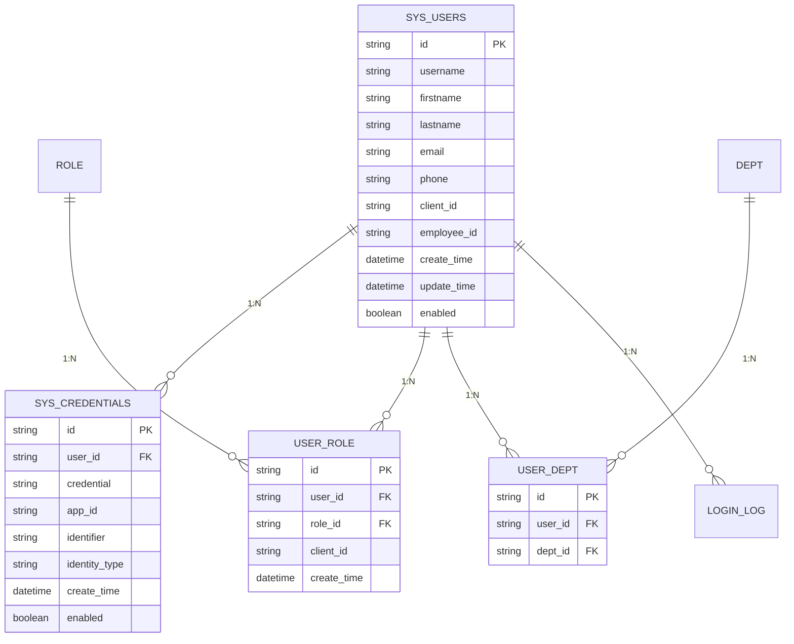

# 账号管理数据模型详解

## 1. 数据模型概述

账号管理系统的数据模型设计遵循领域驱动设计(DDD)原则，将业务概念清晰地映射到数据结构中。主要包含用户信息、认证信息、角色权限、部门组织等核心实体。

## 2. 核心数据模型

### 2.1 账号信息模型 (InsReportAccountInfoModel)

**用途**: 用于账号管理的请求参数和数据传输

**继承关系**: 继承自Page类，支持分页查询

```java
@Data
@Builder
@NoArgsConstructor
@AllArgsConstructor
@EqualsAndHashCode(callSuper = false)
public class InsReportAccountInfoModel extends Page implements Serializable {
    @Schema(description = "用户id")
    private String userId;
    
    @Schema(description = "部门id")
    private List<String> deptId;
    
    @Schema(description = "角色ID")
    private String roleId;
    
    @Schema(description = "员工编号")
    private String employeeId;
    
    @Schema(description = "账号名称")
    private String accountName;
    
    @Schema(description = "账号密码")
    private String accountPwd;
    
    @Schema(description = "用户名")
    private String userName;
    
    @Schema(description = "联系方式")
    private String contact;
    
    @Schema(description = "职位")
    private String position;
    
    @Schema(description = "邮箱")
    private String email;
    
    @Schema(description = "备注")
    private String remark;
    
    @Schema(description = "停用/启用状态 停用:0 启用:1 默认启用")
    private String status;
    
    @Schema(description = "客户id")
    private String clientId;
    
    private String enable;
    
    @Schema(description = "登录类型 表单:base 邮箱:email 默认为表单类型")
    @Builder.Default
    private String loginType = "base";
}
```

**字段详解**:

| 字段名 | 类型 | 长度限制 | 必填 | 默认值 | 说明 |
|--------|------|----------|------|--------|------|
| userId | String | 60 | 否 | - | 系统生成的唯一用户标识 |
| deptId | List<String> | - | 否 | - | 用户所属部门ID列表，支持多部门 |
| roleId | String | 60 | 否 | - | 用户角色ID |
| employeeId | String | 50 | 否 | - | 企业员工编号 |
| accountName | String | 100 | 是 | - | 登录账号名，需唯一 |
| accountPwd | String | 500 | 是 | - | 登录密码，存储时加密 |
| userName | String | 100 | 是 | - | 用户真实姓名 |
| contact | String | 20 | 否 | - | 联系电话 |
| position | String | 100 | 否 | - | 职位信息 |
| email | String | 50 | 否 | - | 邮箱地址 |
| remark | String | 500 | 否 | - | 备注信息 |
| status | String | 1 | 否 | "1" | 账号状态：0-停用，1-启用 |
| clientId | String | 20 | 是 | - | 客户标识 |
| enable | String | 1 | 否 | - | 启用标识 |
| loginType | String | 10 | 否 | "base" | 登录方式：base-表单，email-邮箱 |

### 2.2 账号信息视图模型 (InsReportAccountInfoVo)

**用途**: 用于账号信息的响应数据展示

```java
@Data
@Builder
@NoArgsConstructor
@AllArgsConstructor
public class InsReportAccountInfoVo implements Serializable {
    @Schema(description = "用户id")
    private String userId;
    
    @Schema(description = "账号名称")
    private String accountName;
    
    @Schema(description = "用户名")
    private String userName;
    
    @Schema(description = "员工编号")
    private String employeeId;
    
    @Schema(description = "部门名称")
    private String deptName;
    
    @Schema(description = "部门id")
    private String deptId;
    
    @Schema(description = "角色名称")
    private String roleName;
    
    @Schema(description = "角色id")
    private String roleId;
    
    @Schema(description = "停用/启用状态 停用:0 启用:1 默认启用")
    @Dict(code = InsReportsightsConstants.ENABLE_CODE)
    private String status;
    
    @Schema(description = "登录次数")
    private long loginCounts;
    
    @Schema(description = "最后一次登录时间")
    @JsonFormat(pattern = "yyyy-MM-dd HH:mm:ss")
    private LocalDateTime lastLoginTime;
    
    @Schema(description = "联系方式")
    private String contact;
    
    @Schema(description = "职位")
    private String position;
    
    @Schema(description = "邮箱")
    private String email;
    
    @Schema(description = "备注")
    private String remark;
    
    @Schema(description = "办公电话")
    private String officePhone;
    
    @Schema(description = "家庭电话")
    private String homePhone;
    
    private String phone;
}
```

**特殊注解说明**:
- `@Dict`: 字典转换注解，自动将状态码转换为可读文本
- `@JsonFormat`: JSON序列化时的日期格式化
- `@Schema`: OpenAPI文档注解，用于生成接口文档

### 2.3 角色查询模型 (InsReportRoleQueryModel)

**用途**: 角色信息查询的参数模型

```java
@Data
@Builder
@NoArgsConstructor
@AllArgsConstructor
@EqualsAndHashCode(callSuper = false)
public class InsReportRoleQueryModel extends Page implements Serializable {
    @Schema(description = "角色状态")
    private String enabled;
    
    @Schema(description = "角色名称")
    private String roleName;
    
    @Schema(description = "客户ID")
    @Builder.Default
    private String clientId = "0";
    
    private String roleId;
    private String searchKeyword;
    private String brandCode;
    private String brandName;
    
    @Builder.Default
    private Boolean checkAdmin = Boolean.FALSE;
    
    @Builder.Default
    private Boolean selectAll = Boolean.FALSE;
    
    @Builder.Default
    private List<String> permissionIdList = new ArrayList<>();
    
    @Schema(description = "标签类型")
    private String tagLibType;
}
```

### 2.4 部门信息模型 (StaSysDepartModel)

**用途**: 部门组织架构信息

```java
@Data
@Builder
@NoArgsConstructor
@AllArgsConstructor
public class StaSysDepartModel implements Serializable {
    private String name;  // 部门名称
    private String value; // 部门ID值
}
```

### 2.5 用户角色关联模型 (InsReportUserRoleModel)

**用途**: 用户与角色的关联关系

```java
@Data
@Builder
@NoArgsConstructor
@AllArgsConstructor
@EqualsAndHashCode(callSuper = false)
public class InsReportUserRoleModel implements Serializable {
    private String id;
    private String userId;
    private List<String> userIdList;
    private String roleId;
    private String clientId;
    private LocalDateTime createTime;
}
```

## 3. 数据库表结构

### 3.1 用户表 (sys_users)

```sql
CREATE TABLE `sys_users` (
    `id` varchar(60) NOT NULL COMMENT '主键ID',
    `username` varchar(100) DEFAULT NULL COMMENT '用户名',
    `phone` varchar(20) DEFAULT NULL COMMENT '手机号',
    `firstname` varchar(100) DEFAULT NULL COMMENT '名',
    `lastname` varchar(100) DEFAULT NULL COMMENT '姓',
    `email` varchar(50) DEFAULT NULL COMMENT '邮箱',
    `create_time` datetime DEFAULT CURRENT_TIMESTAMP COMMENT '创建时间',
    `update_time` datetime DEFAULT CURRENT_TIMESTAMP COMMENT '更新时间',
    `enabled` tinyint(1) DEFAULT '1' COMMENT '是否启用',
    `non_locked` tinyint(1) DEFAULT '1' COMMENT '是否锁定',
    `expire_date` datetime DEFAULT NULL COMMENT '过期时间',
    `start_expire_date` datetime DEFAULT NULL COMMENT '开始生效时间',
    `operator` varchar(100) DEFAULT NULL COMMENT '操作人',
    `client_id` varchar(20) DEFAULT NULL COMMENT '客户ID',
    `employee_id` varchar(50) DEFAULT NULL COMMENT '员工编号',
    `remark` varchar(500) DEFAULT NULL COMMENT '备注',
    `position` varchar(100) DEFAULT NULL COMMENT '职位',
    `office_phone` varchar(20) DEFAULT NULL COMMENT '办公电话',
    `home_phone` varchar(20) DEFAULT NULL COMMENT '家庭电话',
    PRIMARY KEY (`id`),
    UNIQUE KEY `uk_username` (`username`),
    KEY `idx_client_id` (`client_id`),
    KEY `idx_employee_id` (`employee_id`)
) ENGINE=InnoDB DEFAULT CHARSET=utf8mb4 COMMENT='用户信息表';
```

### 3.2 认证凭证表 (sys_credentials)

```sql
CREATE TABLE `sys_credentials` (
    `id` varchar(60) NOT NULL COMMENT '主键ID',
    `user_id` varchar(60) NOT NULL COMMENT '用户ID',
    `credential` varchar(500) DEFAULT NULL COMMENT '密码',
    `app_id` varchar(20) NOT NULL COMMENT '应用ID',
    `identifier` varchar(100) NOT NULL COMMENT '登录标识',
    `identity_type` varchar(20) NOT NULL COMMENT '认证类型',
    `create_time` datetime DEFAULT CURRENT_TIMESTAMP COMMENT '创建时间',
    `update_time` datetime DEFAULT CURRENT_TIMESTAMP COMMENT '更新时间',
    `enabled` tinyint(1) DEFAULT '1' COMMENT '是否启用',
    `non_locked` tinyint(1) DEFAULT '1' COMMENT '是否锁定',
    `admin` tinyint(1) DEFAULT '0' COMMENT '是否管理员',
    `expire_date` datetime DEFAULT NULL COMMENT '过期时间',
    `start_expire_date` datetime DEFAULT NULL COMMENT '开始生效时间',
    `operator` varchar(100) DEFAULT NULL COMMENT '操作人',
    PRIMARY KEY (`id`),
    UNIQUE KEY `uk_app_identifier` (`app_id`, `identifier`),
    KEY `idx_user_id` (`user_id`),
    KEY `idx_app_id` (`app_id`)
) ENGINE=InnoDB DEFAULT CHARSET=utf8mb4 COMMENT='认证凭证表';
```

## 4. 数据关系图



## 5. 数据验证规则

### 5.1 字段验证规则

| 字段 | 验证规则 | 错误信息 |
|------|----------|----------|
| accountName | 必填，长度3-100，字母数字下划线 | 账号名称格式不正确 |
| accountPwd | 必填，长度6-50，包含字母数字 | 密码强度不够 |
| userName | 必填，长度2-100 | 用户名不能为空 |
| email | 邮箱格式验证 | 邮箱格式不正确 |
| phone | 手机号格式验证 | 手机号格式不正确 |
| employeeId | 长度限制50字符 | 员工编号过长 |

### 5.2 业务验证规则

1. **账号唯一性**: 同一应用下账号名称必须唯一
2. **邮箱唯一性**: 邮箱地址在系统中必须唯一
3. **员工编号唯一性**: 同一客户下员工编号必须唯一
4. **角色有效性**: 分配的角色必须存在且启用
5. **部门有效性**: 关联的部门必须存在且启用

## 6. 数据字典

### 6.1 状态字典

| 字典码 | 字典值 | 显示名称 | 说明 |
|--------|--------|----------|------|
| ENABLE_CODE | 0 | 停用 | 账号停用状态 |
| ENABLE_CODE | 1 | 启用 | 账号启用状态 |

### 6.2 登录类型字典

| 字典码 | 字典值 | 显示名称 | 说明 |
|--------|--------|----------|------|
| LOGIN_TYPE | base | 表单登录 | 用户名密码登录 |
| LOGIN_TYPE | email | 邮箱登录 | 邮箱验证登录 |

### 6.3 认证类型字典

| 字典码 | 字典值 | 显示名称 | 说明 |
|--------|--------|----------|------|
| IDENTITY_TYPE | phone | 手机认证 | 手机号认证 |
| IDENTITY_TYPE | weixin | 微信认证 | 微信登录认证 |
| IDENTITY_TYPE | base | 基础认证 | 用户名密码认证 |

## 7. 数据迁移和版本控制

### 7.1 数据迁移策略
1. **增量迁移**: 支持数据的增量同步
2. **版本兼容**: 保持向后兼容性
3. **数据校验**: 迁移后进行数据完整性校验

### 7.2 版本控制
- **模型版本**: 使用语义化版本控制
- **字段变更**: 采用渐进式字段变更策略
- **兼容性**: 保持API向后兼容

## 8. 性能优化

### 8.1 索引策略
- **主键索引**: 所有表都有主键索引
- **唯一索引**: 账号名、邮箱等唯一字段
- **复合索引**: 常用查询条件的复合索引
- **外键索引**: 关联查询的外键索引

### 8.2 查询优化
- **分页查询**: 使用LIMIT进行分页
- **条件查询**: 合理使用WHERE条件
- **连接查询**: 优化JOIN操作
- **缓存策略**: 对热点数据进行缓存
