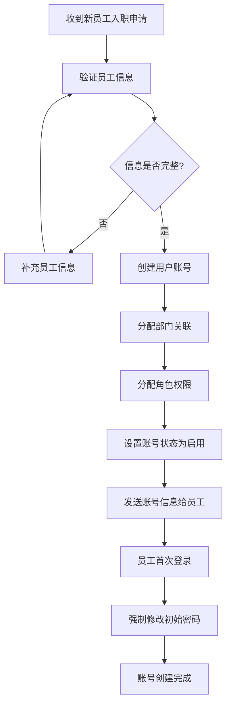
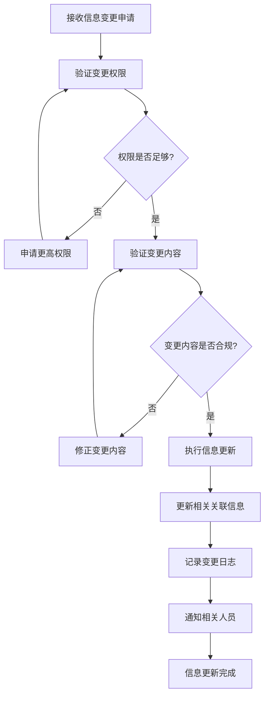
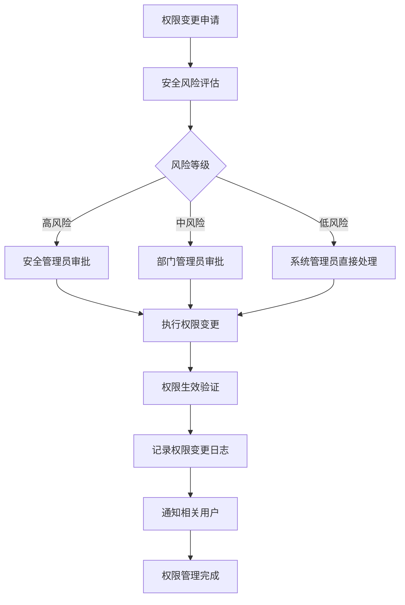
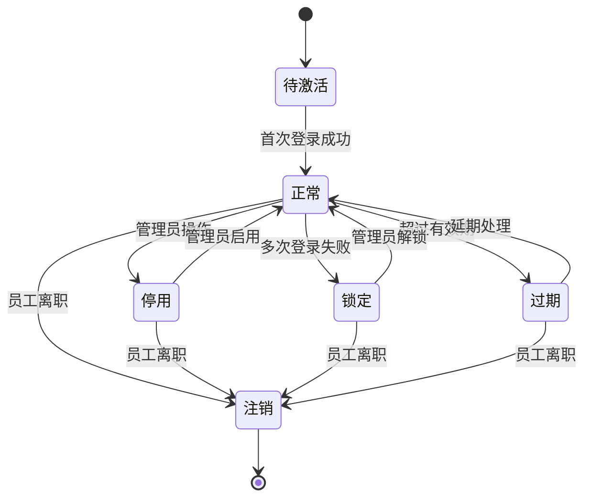
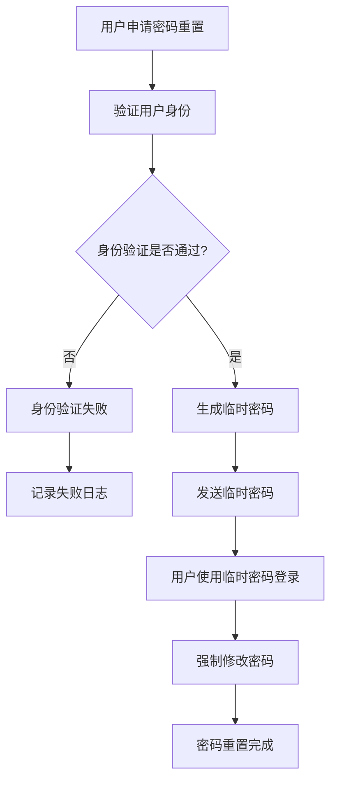

# 账号管理业务流程说明

## 1. 业务流程概述

账号管理系统的业务流程涵盖了用户账号的完整生命周期管理，包括账号创建、权限分配、状态管理、信息维护等核心业务场景。本文档详细描述了各个业务流程的执行步骤、参与角色和关键控制点。

## 2. 核心业务流程

### 2.1 账号创建流程

**流程描述**: 为新员工创建系统访问账号

**参与角色**:
- 系统管理员：负责账号创建和权限分配
- 部门管理员：提供员工基本信息
- 新员工：接收账号信息并首次登录

**流程步骤**:

**详细步骤说明**:

1. **信息收集阶段**
   - 收集员工基本信息：姓名、员工编号、部门、职位、联系方式
   - 验证员工编号唯一性
   - 确认部门和角色信息

2. **账号创建阶段**
   - 生成唯一的用户ID
   - 创建登录账号名（通常为员工编号或姓名拼音）
   - 生成临时密码
   - 设置账号基本信息

3. **权限分配阶段**
   - 根据职位分配对应角色
   - 关联到相应部门
   - 设置访问权限范围

4. **账号激活阶段**
   - 设置账号状态为启用
   - 发送账号信息给员工
   - 员工首次登录并修改密码

**关键控制点**:
- 员工信息的完整性和准确性验证
- 账号名称的唯一性检查
- 角色权限的合规性审核
- 密码安全策略的执行

### 2.2 账号信息更新流程

**流程描述**: 更新员工的账号信息，包括基本信息、部门调整、角色变更等

**参与角色**:
- 系统管理员：执行信息更新操作
- 部门管理员：提供变更申请
- 员工本人：确认信息变更

**流程步骤**:

**变更类型处理**:

1. **基本信息变更**
   - 姓名、联系方式、邮箱等个人信息
   - 直接更新，无需特殊审批

2. **部门调整**
   - 更新部门关联关系
   - 可能需要调整相应的数据访问权限

3. **角色变更**
   - 职位升迁或调岗导致的角色变更
   - 需要管理员审批
   - 涉及权限的增加或减少

4. **状态变更**
   - 账号启用/停用
   - 临时锁定/解锁
   - 需要记录变更原因

### 2.3 账号权限管理流程

**流程描述**: 管理用户的系统访问权限，包括角色分配、权限调整等

**参与角色**:
- 系统管理员：执行权限操作
- 安全管理员：审核权限变更
- 部门管理员：申请权限变更

**流程步骤**:

**权限管理原则**:
- **最小权限原则**: 用户只获得完成工作所需的最小权限
- **职责分离原则**: 敏感操作需要多人协作完成
- **定期审核原则**: 定期审核用户权限的合理性
- **及时回收原则**: 员工离职或调岗时及时回收权限

### 2.4 账号状态管理流程

**流程描述**: 管理账号的生命周期状态，包括启用、停用、锁定、解锁等

**状态转换图**:

**状态管理规则**:

1. **待激活状态**
   - 新创建的账号默认状态
   - 用户首次登录后自动转为正常状态
   - 超过30天未激活自动转为过期状态

2. **正常状态**
   - 用户可以正常使用系统功能
   - 定期检查账号活跃度
   - 长期未使用的账号会收到提醒

3. **锁定状态**
   - 连续登录失败超过限制次数自动锁定
   - 可以通过管理员手动解锁
   - 锁定期间无法登录系统

4. **停用状态**
   - 管理员手动停用的账号
   - 临时不需要使用系统的员工
   - 可以随时重新启用

5. **过期状态**
   - 超过账号有效期的账号
   - 需要管理员延期处理
   - 过期账号无法登录

6. **注销状态**
   - 员工离职后的最终状态
   - 账号信息保留但无法使用
   - 不可逆转的状态

### 2.5 密码管理流程

**流程描述**: 管理用户密码的安全策略，包括密码重置、定期更换等

**密码重置流程**:

**密码安全策略**:
- **复杂度要求**: 至少8位，包含大小写字母、数字和特殊字符
- **有效期限制**: 密码有效期90天，到期前7天提醒用户更换
- **历史密码**: 不能使用最近5次使用过的密码
- **锁定策略**: 连续5次输入错误密码锁定账号30分钟

## 3. 异常处理流程

### 3.1 账号异常检测

**检测规则**:
- 异地登录检测
- 异常时间登录检测
- 频繁操作检测
- 权限异常使用检测

**处理流程**:
1. 系统自动检测异常行为
2. 触发安全警报
3. 自动或手动锁定账号
4. 通知安全管理员
5. 调查异常原因
6. 采取相应处理措施

### 3.2 数据同步异常处理

**同步异常类型**:
- 用户信息同步失败
- 权限信息同步延迟
- 部门信息不一致

**处理策略**:
1. 自动重试机制
2. 异常数据记录
3. 手动数据修复
4. 同步状态监控

## 4. 业务规则和约束

### 4.1 账号命名规则
- 账号名称长度3-20位
- 只能包含字母、数字和下划线
- 不能以数字开头
- 系统内必须唯一

### 4.2 权限分配规则
- 新员工默认分配基础权限
- 权限变更需要审批流程
- 敏感权限需要双重确认
- 临时权限有时间限制

### 4.3 数据保护规则
- 个人敏感信息加密存储
- 操作日志完整记录
- 数据访问权限控制
- 定期数据备份

## 5. 监控和审计

### 5.1 操作监控
- 实时监控用户登录状态
- 监控权限使用情况
- 监控异常操作行为
- 监控系统性能指标

### 5.2 审计要求
- 所有账号操作必须记录日志
- 权限变更需要审计跟踪
- 定期生成审计报告
- 保留审计数据至少1年

## 6. 应急处理预案

### 6.1 账号泄露处理
1. 立即锁定相关账号
2. 通知安全管理员
3. 调查泄露原因和范围
4. 重置相关密码
5. 加强安全监控

### 6.2 系统故障处理
1. 启动应急响应流程
2. 评估故障影响范围
3. 实施临时解决方案
4. 修复系统故障
5. 恢复正常服务

## 7. 持续改进

### 7.1 流程优化
- 定期评估流程效率
- 收集用户反馈意见
- 分析操作数据统计
- 持续优化业务流程

### 7.2 安全加强
- 定期安全风险评估
- 更新安全策略规则
- 加强安全培训教育
- 引入新的安全技术
